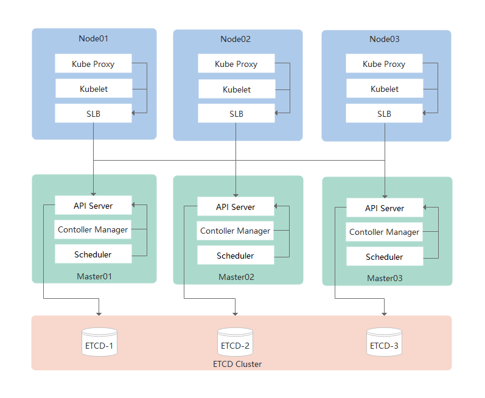
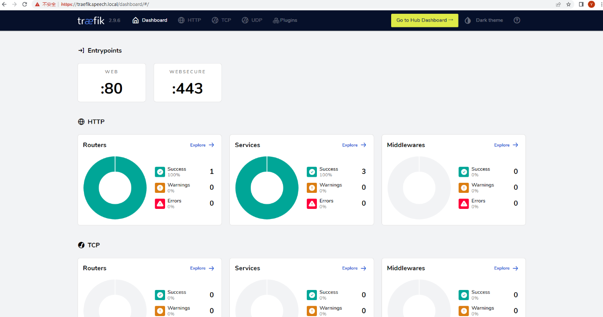
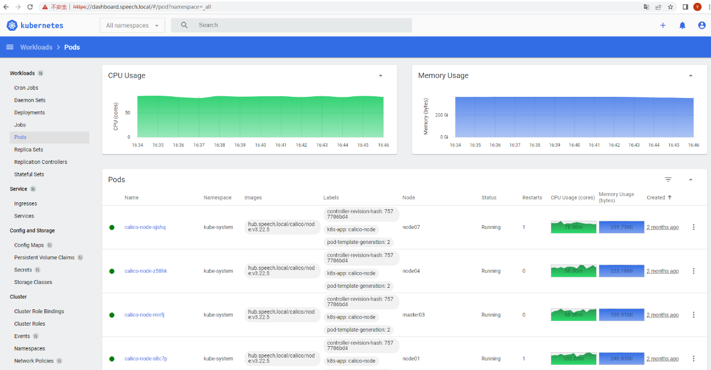

## 一、部署生产Kubernetes集群环境（基于二进制）
#### 1、架构图：


#### 2、集群规划：
|ID  |服务器IP    |主机名           |系统版本            |
|:-: |:-:         |:-:              |:-:                 |
|1   |10.20.1.201 |master01,etcd-1  |Ubuntu 18.04.6 LTS  |
|2   |10.20.1.202 |master02,etcd-2  |Ubuntu 18.04.6 LTS  |
|3   |10.20.1.203 |master03,etcd-3  |Ubuntu 18.04.6 LTS  |
|4   |10.20.1.204 |node01           |Ubuntu 20.04.6 LTS  |
|5   |10.20.1.205 |node02           |Ubuntu 20.04.6 LTS  | 
|6   |10.20.1.206 |node03           |Ubuntu 20.04.6 LTS  |
|7   |10.20.1.207 |node04           |Ubuntu 20.04.6 LTS  |
|8   |10.20.1.208 |node05           |Ubuntu 20.04.6 LTS  |
|9   |10.20.1.209 |node06           |Ubuntu 20.04.6 LTS  |

#### 3、软件包及相关信息：
```shell
软件包：                                                         描述：
k8s-v1.23.17/pkgs/k8s-etcd-3.5.6_amd64.deb                       持久状态存储etcd
k8s-v1.23.17/pkgs/k8s-kubernetes-master-1.23.17_amd64.deb        master核心组件（kube-apiserver、kube-controller-manager、kube-scheduler）
k8s-v1.23.17/pkgs/k8s-kubernetes-node-1.23.17_amd64.deb          node核心组件（kubelet、kube-proxy）
k8s-v1.23.17/pkgs/k8s-slb-1.16.1_amd64.deb                       服务负载均衡（nginx四层代理），部署在各node之上，代理kubelet、kube-proxy访问kube-apiserver
k8s-v1.23.17/calico-v3.22.5                                      网络插件calico
k8s-v1.23.17/coredns-v1.8.6                                      服务发现coredns
k8s-v1.23.17/ingress-controllers/traefik-v2.9.6                  七层代理ingress controller
k8s-v1.23.17/dashboard-v2.5.1                                    集群可视化dashboard
k8s-v1.23.17/metrics-server-v0.6.1                               核心指标监控metrics-server
k8s-v1.23.17/docker-ce-v20.10.12                                 容器服务docker（deb包从阿里云镜像站下载）
k8s-v1.23.17/nvidia-docker2-v2.12.0                              GPU相关，能够在容器内部调用GPU资源
k8s-v1.23.17/k8s-device-plugin-v0.13.0                           GPU相关，能够在K8s集群调用GPU资源
k8s-v1.23.17/k8s-etcd-v3.5.6                                     通过dpkg -b命令将该目录打包为k8s-etcd-3.5.6_amd64.deb安装包，方便部署
k8s-v1.23.17/k8s-kubernetes-master                               通过dpkg -b命令将该目录打包为k8s-kubernetes-master-1.23.17_amd64.deb安装包，方便部署
k8s-v1.23.17/k8s-kubernetes-node                                 通过dpkg -b命令将该目录打包为k8s-kubernetes-node-1.23.17_amd64.deb安装包，方便部署
k8s-v1.23.17/k8s-slb-v1.16.1                                     通过dpkg -b命令将该目录打包为k8s-slb-1.16.1_amd64.deb安装包，方便部署

注意：
k8s-etcd、k8s-kubernetes-master、k8s-kubernetes-node包中二进制程序由官方下载（链接如下），此处仅做了二次封装，k8s-slb由nginx-1.16.1.tar.gz（官方下载）源码编译，未更改过任何源代码
https://github.com/etcd-io/etcd/releases/download/v3.5.6/etcd-v3.5.6-linux-amd64.tar.gz
https://dl.k8s.io/v1.23.17/kubernetes-server-linux-amd64.tar.gz
```

#### 4、集群默认配置：
- Pod地址池：10.244.0.0/16
- Service地址池：10.254.0.0/16
- Service代理模型：ipvs（调度算法默认采用lc）
- Service端口范围：30000 - 50000
- Cluster Domain：cluster.local
- Kubernetes和etcd证书默认签发时长：50年
- Kubelet证书默认签发时长：10年

#### 5、基础环境配置（略）：
- 关闭swap
- 配置时间同步
- 配置时区为Asia/Shanghai
- 配置主机名
- 配置master01到master02、master03免密登录
- 关闭并卸载unattended-upgrades自动更新服务
- 提前安装ipvsadm、ipset
- 提前安装私有镜像仓库Harbor（当前Harbor域名解析为：hub.speech.local）
- 添加各节点DNS解析（内部域为：k8s.speech.local）或调整本地hosts文件
- GPU设备需要安装相关驱动及cuda
- 安装配置Docker（各个节点都需要）：
```shell
root@master01:~# cd k8s-v1.23.17/docker-ce-v20.10.12/
root@master01:~/k8s-v1.23.9/docker-ce-v20.10.12# dpkg -i containerd.io-1.6.8_amd64.deb
root@master01:~/k8s-v1.23.9/docker-ce-v20.10.12# cd ubuntu18.04        # 或cd ubuntu20.04
root@master01:~/k8s-v1.23.9/docker-ce-v20.10.12# dpkg -i *
```
- GPU设备需要安装nvidia-docker2
```shell
root@master01:~/k8s-v1.23.17# cd nvidia-docker2-v2.12.0
root@master01:~/k8s-v1.23.17/nvidia-docker2-v2.12.0# dpkg -i *
```
- 调整docker配置文件
```shell
root@master01# cat > /etc/docker/daemon.json <<EOF       # 非GPU设备
{
    "exec-opts": ["native.cgroupdriver=systemd"],
    "log-driver": "json-file",
    "log-opts": {
        "max-size": "100m"
    },
    "storage-driver": "overlay2",
    "insecure-registries": ["hub.speech.local"]
}
EOF
```
```shell
root@master01# cat > /etc/docker/daemon.json <<EOF       # GPU设备
{
    "exec-opts": ["native.cgroupdriver=systemd"],
    "log-driver": "json-file",
    "log-opts": {
        "max-size": "100m"
    },
    "storage-driver": "overlay2",
    "insecure-registries": ["hub.speech.local"],
    "default-runtime": "nvidia",
    "runtimes": {
        "nvidia": {
            "path": "nvidia-container-runtime",
            "runtimeArgs": []
        }
    }
}
EOF
```
```shell
root@master01# systemctl restart docker
```


## 二、部署ETCD集群
#### 1、分别在etcd-1、etcd-2、etcd-3节点安装k8s-etcd-3.5.6_amd64.deb核心组件：
```shell
root@master01:~# cd k8s-v1.23.17/pkgs/
root@master01:~/k8s-v1.23.17/pkgs# dpkg -i k8s-etcd-3.5.6_amd64.deb 
Selecting previously unselected package k8s-etcd.
(Reading database ... 168167 files and directories currently installed.)
Preparing to unpack k8s-etcd-3.5.6_amd64.deb ...
Unpacking k8s-etcd (3.5.6) ...
Setting up k8s-etcd (3.5.6) ...
```
```shell
root@master01:~/k8s-v1.23.17/pkgs# scp k8s-etcd-3.5.6_amd64.deb root@master02:/root
root@master01:~/k8s-v1.23.17/pkgs# scp k8s-etcd-3.5.6_amd64.deb root@master03:/root
root@master01:~/k8s-v1.23.17/pkgs# ssh root@master02 'cd /root && dpkg -i k8s-etcd-3.5.6_amd64.deb'
root@master01:~/k8s-v1.23.17/pkgs# ssh root@master03 'cd /root && dpkg -i k8s-etcd-3.5.6_amd64.deb'
```

#### 2、在etcd-1节点初始化etcd证书（注意以双下滑线开头结尾的配置项需要调整）：
```shell
root@master01:~# cd /k8s/etcd/ssl/cfssl-tools
root@master01:/k8s/etcd/ssl/cfssl-tools# vi etcd-csr.json
{
    "CN": "etcd",
    "hosts": [
        "10.20.1.201",
        "10.20.1.202",
        "10.20.1.203",
        "127.0.0.1",
        "localhost"
    ],
    "key": {
        "algo": "rsa",
        "size": 2048
    },
    "names": [
        {
            "C": "CN",
            "ST": "BeiJing",
            "L": "BeiJing",
            "O": "etcd",
            "OU": "System"
        }
    ]
}
root@master01:/k8s/etcd/ssl/cfssl-tools# vi peer-csr.json
{
    "CN": "peer",
    "hosts": [
        "10.20.1.201",
        "10.20.1.202",
        "10.20.1.203",
        "127.0.0.1",
        "localhost"
    ],
    "key": {
        "algo": "rsa",
        "size": 2048
    },
    "names": [
        {
            "C": "CN",
            "ST": "BeiJing",
            "L": "BeiJing",
            "O": "etcd",
            "OU": "System"
        }
    ]
}
root@master01:/k8s/etcd/ssl/cfssl-tools# ./init-certs.sh  # 初始化证书
Init Etcd Certs OK.
root@master01:/k8s/etcd/ssl/cfssl-tools# ls -lh ../
total 40K
-rw-r--r-- 1 root root 1.1K Apr  2 15:55 ca.csr
-rw------- 1 root root 1.7K Apr  2 15:55 ca-key.pem
-rw-r--r-- 1 root root 1.3K Apr  2 15:55 ca.pem
drwxr-xr-x 2 root root 4.0K Jun 27 10:52 cfssl-tools
-rw-r--r-- 1 root root 1.1K Apr  2 15:55 etcd.csr
-rw------- 1 root root 1.7K Apr  2 15:55 etcd-key.pem
-rw-r--r-- 1 root root 1.4K Apr  2 15:55 etcd.pem
-rw-r--r-- 1 root root 1.1K Apr  2 15:55 peer.csr
-rw------- 1 root root 1.7K Apr  2 15:55 peer-key.pem
-rw-r--r-- 1 root root 1.5K Apr  2 15:55 peer.pem
```

#### 3、分发etcd证书到etcd-2、etcd-3节点：
```shell
root@master-1:~# cd /k8s/etcd
root@master-1:/k8s/etcd# scp -r ssl root@master02:/k8s/etcd
root@master-1:/k8s/etcd# scp -r ssl root@master03:/k8s/etcd
```

#### 4、分别调整etcd-1、etcd-2、etcd-3节点etcd配置文件：
etcd-1：
```shell
root@master01:~# cd /k8s/etcd/cfg
root@master01:/k8s/etcd/cfg# ln -svf etcd.cluster etcd    # 注意etcd默认配置为单实例，这里调整配置为集群
'etcd' -> 'etcd.cluster'
root@master01:/k8s/etcd/cfg# vi etcd                      # 注意所有双下滑杠开头结尾的配置项都需要调整，ETCD_ARGS和ETCD_DATA_DIR变量值建议调整与节点一致
#[Member]
ETCD_ARGS="--name=etcd-1"
ETCD_DATA_DIR="/k8s/etcd/etcd-1.data"
ETCD_LISTEN_CLIENT_URLS="https://10.20.1.201:2379,https://127.0.0.1:2379"
ETCD_ADVERTISE_CLIENT_URLS="https://10.20.1.201:2379"


#[Clustering]
ETCD_LISTEN_PEER_URLS="https://10.20.1.201:2380"
ETCD_INITIAL_ADVERTISE_PEER_URLS="https://10.20.1.201:2380"
ETCD_INITIAL_CLUSTER="etcd-1=https://10.20.1.201:2380,etcd-2=https://10.20.1.202:2380,etcd-3=https://10.20.1.203:2380"
ETCD_INITIAL_CLUSTER_STATE="new"
ETCD_INITIAL_CLUSTER_TOKEN="etcd-cluster"


#[Security]
ETCD_AUTO_TLS="true"
ETCD_CLIENT_CERT_AUTH="true"
ETCD_TRUSTED_CA_FILE="/k8s/etcd/ssl/ca.pem"
ETCD_CERT_FILE="/k8s/etcd/ssl/etcd.pem"
ETCD_KEY_FILE="/k8s/etcd/ssl/etcd-key.pem"
ETCD_PEER_AUTO_TLS="true"
ETCD_PEER_CLIENT_CERT_AUTH="true"
ETCD_PEER_TRUSTED_CA_FILE="/k8s/etcd/ssl/ca.pem"
ETCD_PEER_CERT_FILE="/k8s/etcd/ssl/peer.pem"
ETCD_PEER_KEY_FILE="/k8s/etcd/ssl/peer-key.pem"
```
etcd-2：
```shell
root@master02:~# cd /k8s/etcd/cfg
root@master02:/k8s/etcd/cfg# ln -svf etcd.cluster etcd
'etcd' -> 'etcd.cluster'
root@master02:/k8s/etcd/cfg# vi etcd 
#[Member]
ETCD_ARGS="--name=etcd-2"
ETCD_DATA_DIR="/k8s/etcd/etcd-2.data"
ETCD_LISTEN_CLIENT_URLS="https://10.20.1.202:2379,https://127.0.0.1:2379"
ETCD_ADVERTISE_CLIENT_URLS="https://10.20.1.202:2379"


#[Clustering]
ETCD_LISTEN_PEER_URLS="https://10.20.1.202:2380"
ETCD_INITIAL_ADVERTISE_PEER_URLS="https://10.20.1.202:2380"
ETCD_INITIAL_CLUSTER="etcd-1=https://10.20.1.201:2380,etcd-2=https://10.20.1.202:2380,etcd-3=https://10.20.1.203:2380"
ETCD_INITIAL_CLUSTER_STATE="new"
ETCD_INITIAL_CLUSTER_TOKEN="etcd-cluster"


#[Security]
ETCD_AUTO_TLS="true"
ETCD_CLIENT_CERT_AUTH="true"
ETCD_TRUSTED_CA_FILE="/k8s/etcd/ssl/ca.pem"
ETCD_CERT_FILE="/k8s/etcd/ssl/etcd.pem"
ETCD_KEY_FILE="/k8s/etcd/ssl/etcd-key.pem"
ETCD_PEER_AUTO_TLS="true"
ETCD_PEER_CLIENT_CERT_AUTH="true"
ETCD_PEER_TRUSTED_CA_FILE="/k8s/etcd/ssl/ca.pem"
ETCD_PEER_CERT_FILE="/k8s/etcd/ssl/peer.pem"
ETCD_PEER_KEY_FILE="/k8s/etcd/ssl/peer-key.pem"
```
etcd-3：
```shell
root@master03:~# cd /k8s/etcd/cfg
root@master03:/k8s/etcd/cfg# ln -svf etcd.cluster etcd
'etcd' -> 'etcd.cluster'
root@master03:/k8s/etcd/cfg# vi etcd 
#[Member]
ETCD_ARGS="--name=etcd-3"
ETCD_DATA_DIR="/k8s/etcd/etcd-3.data"
ETCD_LISTEN_CLIENT_URLS="https://10.20.1.203:2379,https://127.0.0.1:2379"
ETCD_ADVERTISE_CLIENT_URLS="https://10.20.1.203:2379"


#[Clustering]
ETCD_LISTEN_PEER_URLS="https://10.20.1.203:2380"
ETCD_INITIAL_ADVERTISE_PEER_URLS="https://10.20.1.203:2380"
ETCD_INITIAL_CLUSTER="etcd-1=https://10.20.1.201:2380,etcd-2=https://10.20.1.202:2380,etcd-3=https://10.20.1.203:2380"
ETCD_INITIAL_CLUSTER_STATE="new"
ETCD_INITIAL_CLUSTER_TOKEN="etcd-cluster"


#[Security]
ETCD_AUTO_TLS="true"
ETCD_CLIENT_CERT_AUTH="true"
ETCD_TRUSTED_CA_FILE="/k8s/etcd/ssl/ca.pem"
ETCD_CERT_FILE="/k8s/etcd/ssl/etcd.pem"
ETCD_KEY_FILE="/k8s/etcd/ssl/etcd-key.pem"
ETCD_PEER_AUTO_TLS="true"
ETCD_PEER_CLIENT_CERT_AUTH="true"
ETCD_PEER_TRUSTED_CA_FILE="/k8s/etcd/ssl/ca.pem"
ETCD_PEER_CERT_FILE="/k8s/etcd/ssl/peer.pem"
ETCD_PEER_KEY_FILE="/k8s/etcd/ssl/peer-key.pem"
```

#### 5、分别启动etcd-1、etcd-2、etcd-3节点的etcd服务：
```shell
root@master01:~# systemctl start etcd && systemctl enable etcd
root@master01:~# ssh root@master02 'systemctl start etcd && systemctl enable etcd'
root@master01:~# ssh root@master03 'systemctl start etcd && systemctl enable etcd'
```
```shell
root@master01:~# systemctl status etcd
● etcd.service - Etcd Server
   Loaded: loaded (/lib/systemd/system/etcd.service; enabled; vendor preset: enabled)
   Active: active (running) since Sun 2023-04-02 17:34:26 CST; 2 months 24 days ago
 Main PID: 1553 (etcd)
    Tasks: 39 (limit: 4915)
   CGroup: /system.slice/etcd.service
           └─1553 /k8s/etcd/bin/etcd --name=etcd-1

root@master01:~# ssh root@master02 'systemctl status etcd'
root@master01:~# ssh root@master03 'systemctl status etcd'
```


## 三、部署Kubernetes集群
#### 1、分别在master01、master02、master03节点安装k8s-kubernetes-master-1.23.17_amd64.deb、k8s-kubernetes-node-1.23.17_amd64.deb核心组件：
```shell
root@master01:~# cd k8s-v1.23.17/pkgs/
root@master01:~/k8s-v1.23.17/pkgs# dpkg -i k8s-kubernetes-master-1.23.17_amd64.deb k8s-kubernetes-node-1.23.17_amd64.deb 
Selecting previously unselected package k8s-kubernetes-master.
(Reading database ... 168149 files and directories currently installed.)
Preparing to unpack k8s-kubernetes-master-1.23.17_amd64.deb ...
Unpacking k8s-kubernetes-master (1.23.17) ...
Selecting previously unselected package k8s-kubernetes-node.
Preparing to unpack k8s-kubernetes-node-1.23.17_amd64.deb ...
Unpacking k8s-kubernetes-node (1.23.17) ...
Setting up k8s-kubernetes-master (1.23.17) ...
Setting up k8s-kubernetes-node (1.23.17) ...
```
```shell
root@master01:~/k8s-v1.23.17/pkgs# scp k8s-kubernetes-master-1.23.17_amd64.deb k8s-kubernetes-node-1.23.17_amd64.deb root@master02:/root
root@master01:~/k8s-v1.23.17/pkgs# scp k8s-kubernetes-master-1.23.17_amd64.deb k8s-kubernetes-node-1.23.17_amd64.deb root@master03:/root
root@master01:~/k8s-v1.23.17/pkgs# ssh root@master02 'cd /root && dpkg -i k8s-kubernetes-master-1.23.17_amd64.deb k8s-kubernetes-node-1.23.17_amd64.deb'
root@master01:~/k8s-v1.23.17/pkgs# ssh root@master03 'cd /root && dpkg -i k8s-kubernetes-master-1.23.17_amd64.deb k8s-kubernetes-node-1.23.17_amd64.deb'
```

#### 2、在master01节点初始化kubernetes集群证书：
```shell
root@master01:~# cd /k8s/kubernetes/ssl/cfssl-tools
root@master01:/k8s/kubernetes/ssl/cfssl-tools# vi kube-apiserver-csr.json  # 注意以双下滑线开头结尾的配置项需要调整
{
    "CN": "kubernetes",
    "hosts": [
        "10.20.1.200",                             # 预留一个vip
        "10.20.1.201",
        "10.20.1.202",
        "10.20.1.203",
        "master.k8s.speech.local",                 # vip对应的域名
        "master01.k8s.speech.local",
        "master02.k8s.speech.local",
        "master03.k8s.speech.local",
        "10.254.0.1",
        "127.0.0.1",
        "localhost",
        "kubernetes",
        "kubernetes.default",
        "kubernetes.default.svc",
        "kubernetes.default.svc.cluster",
        "kubernetes.default.svc.cluster.local"
    ],
    "key": {
        "algo": "rsa",
        "size": 2048
    },
    "names": [
        {
            "C": "CN",
            "ST": "BeiJing",
            "L": "BeiJing",
            "O": "k8s",
            "OU": "System"
        }
    ]
}
root@master01:/k8s/kubernetes/ssl/cfssl-tools# ./init-certs.sh  # 初始化证书
Init Kubernetes Certs OK.
Init Front Proxy Certs OK.
root@master01:/k8s/kubernetes/ssl/cfssl-tools# ls -lh ../
total 120K
-rw-r--r-- 1 root root 1009 Apr  2 16:37 admin.csr
-rw------- 1 root root 1.7K Apr  2 16:37 admin-key.pem
-rw-r--r-- 1 root root 1.4K Apr  2 16:37 admin.pem
-rw-r--r-- 1 root root 1.1K Apr  2 16:37 ca.csr
-rw------- 1 root root 1.7K Apr  2 16:37 ca-key.pem
-rw-r--r-- 1 root root 1.3K Apr  2 16:37 ca.pem
drwxr-xr-x 2 root root 4.0K Apr  2 16:37 cfssl-tools
-rw-r--r-- 1 root root  944 Apr  2 16:37 front-proxy-ca.csr
-rw------- 1 root root 1.7K Apr  2 16:37 front-proxy-ca-key.pem
-rw-r--r-- 1 root root 1.1K Apr  2 16:37 front-proxy-ca.pem
-rw-r--r-- 1 root root  903 Apr  2 16:37 front-proxy-client.csr
-rw------- 1 root root 1.7K Apr  2 16:37 front-proxy-client-key.pem
-rw-r--r-- 1 root root 1.2K Apr  2 16:37 front-proxy-client.pem
-rw-r--r-- 1 root root 1.5K Apr  2 16:37 kube-apiserver.csr
-rw------- 1 root root 1.7K Apr  2 16:37 kube-apiserver-key.pem
-rw-r--r-- 1 root root 1.8K Apr  2 16:37 kube-apiserver.pem
-rw-r--r-- 1 root root 1.1K Apr  2 16:37 kube-controller-manager.csr
-rw------- 1 root root 1.7K Apr  2 16:37 kube-controller-manager-key.pem
-rw-r--r-- 1 root root 1.4K Apr  2 16:37 kube-controller-manager.pem
-rw-r--r-- 1 root root 1009 Apr  2 16:37 kube-proxy.csr
-rw------- 1 root root 1.7K Apr  2 16:37 kube-proxy-key.pem
-rw-r--r-- 1 root root 1.4K Apr  2 16:37 kube-proxy.pem
-rw-r--r-- 1 root root 1017 Apr  2 16:37 kube-scheduler.csr
-rw------- 1 root root 1.7K Apr  2 16:37 kube-scheduler-key.pem
-rw-r--r-- 1 root root 1.4K Apr  2 16:37 kube-scheduler.pem
-rw------- 1 root root 1.7K Apr  2 16:37 sa.key
-rw-r--r-- 1 root root  451 Apr  2 16:37 sa.pub
```

#### 3、分发kubernetes集群证书到master02、master03节点：
```shell
root@master01:~# cd /k8s/kubernetes
root@master01:/k8s/kubernetes# scp -r ssl root@master02:/k8s/kubernetes
root@master01:/k8s/kubernetes# scp -r ssl root@master03:/k8s/kubernetes
```

#### 4、初始化kubeconfig配置文件：
```shell
root@master01:~# cd /k8s/kubernetes/cfg/init-kubeconfig
root@master01:/k8s/kubernetes/cfg/init-kubeconfig# ./init-kubeconfig.sh 
Cluster "kubernetes" set.
User "kube-scheduler" set.
Context "kube-scheduler@kubernetes" created.
Switched to context "kube-scheduler@kubernetes".
Cluster "kubernetes" set.
User "kube-controller-manager" set.
Context "kube-controller-manager@kubernetes" created.
Switched to context "kube-controller-manager@kubernetes".
Cluster "kubernetes" set.
User "admin" set.
Context "admin@kubernetes" created.
Switched to context "admin@kubernetes".
Cluster "kubernetes" set.
User "kube-proxy" set.
Context "kube-proxy@kubernetes" created.
Switched to context "kube-proxy@kubernetes".
Cluster "kubernetes" set.
User "kubelet-bootstrap" set.
Context "kubelet-bootstrap@kubernetes" created.
Switched to context "kubelet-bootstrap@kubernetes".
Token: 5472....b063....c6b4....9b08....,kubelet-bootstrap,10001,system:kubelet-bootstrap
root@master01:/k8s/kubernetes/cfg/init-kubeconfig# ls -lh ../
total 68K
-rw------- 1 root root 6.1K Apr  2 16:41 admin.kubeconfig
-rw------- 1 root root 2.1K Apr  2 16:41 bootstrap.kubeconfig
drwxr-xr-x 2 root root 4.0K Mar 30 18:36 init-kubeconfig
-rw-r--r-- 1 root root 1.5K Apr  2 16:54 kube-apiserver
-rw-r--r-- 1 root root 1.1K Jan 30 09:30 kube-controller-manager
-rw------- 1 root root 6.2K Apr  2 16:41 kube-controller-manager.kubeconfig
-rw-r--r-- 1 root root  594 Mar 30 18:54 kubelet
-rw------- 1 root root 2.2K Apr  2 17:09 kubelet.kubeconfig
-rw-r--r-- 1 root root  181 Jan 30 09:56 kube-proxy
-rw------- 1 root root 6.1K Apr  2 16:41 kube-proxy.kubeconfig
-rw-r--r-- 1 root root  346 Jan 30 09:30 kube-scheduler
-rw------- 1 root root 6.2K Apr  2 16:41 kube-scheduler.kubeconfig
-rw-r--r-- 1 root root   82 Apr  2 16:41 token.csv
```

#### 5、分发kubeconfig配置文件到master02、master03节点：
```shell
root@master01:~# cd /k8s/kubernetes
root@master01:/k8s/kubernetes# scp -r cfg root@master02:/k8s/kubernetes
root@master01:/k8s/kubernetes# scp -r cfg root@master03:/k8s/kubernetes
```

#### 6、调整master01、master02、master03节点kube-apiserver配置：
master01：
```shell
root@master01:~# vi /k8s/kubernetes/cfg/kube-apiserver
KUBE_APISERVER_ARGS=" \
    --advertise-address=10.20.1.201 \                                                              # 调整此项
    --allow-privileged=true \
    --authorization-mode=Node,RBAC \
    --enable-admission-plugins=NodeRestriction \
    --anonymous-auth=false \
    --bind-address=0.0.0.0 \
    --secure-port=6443 \
    --enable-bootstrap-token-auth=true \
    --token-auth-file=/k8s/kubernetes/cfg/token.csv \
    --client-ca-file=/k8s/kubernetes/ssl/ca.pem \
    --tls-cert-file=/k8s/kubernetes/ssl/kube-apiserver.pem \
    --tls-private-key-file=/k8s/kubernetes/ssl/kube-apiserver-key.pem \
    --etcd-servers=https://10.20.1.201:2379,https://10.20.1.202:2379,https://10.20.1.203:2379 \    # 调整此项
    --etcd-cafile=/k8s/etcd/ssl/ca.pem \
    --etcd-certfile=/k8s/etcd/ssl/etcd.pem \
    --etcd-keyfile=/k8s/etcd/ssl/etcd-key.pem \
    --service-cluster-ip-range=10.254.0.0/16 \
    --service-node-port-range=30000-50000 \
    --service-account-issuer=https://kubernetes.default.svc.cluster.local \
    --service-account-key-file=/k8s/kubernetes/ssl/sa.pub \
    --service-account-signing-key-file=/k8s/kubernetes/ssl/sa.key \
    --proxy-client-cert-file=/k8s/kubernetes/ssl/front-proxy-client.pem \
    --proxy-client-key-file=/k8s/kubernetes/ssl/front-proxy-client-key.pem \
    --requestheader-allowed-names=front-proxy-client \
    --requestheader-client-ca-file=/k8s/kubernetes/ssl/front-proxy-ca.pem \
    --requestheader-extra-headers-prefix=X-Remote-Extra- \
    --requestheader-group-headers=X-Remote-Group \
    --requestheader-username-headers=X-Remote-User \
    --v=2"
```
master02：
```shell
root@master02:~# vi /k8s/kubernetes/cfg/kube-apiserver
KUBE_APISERVER_ARGS=" \
    --advertise-address=10.20.1.202 \
    --allow-privileged=true \
    --authorization-mode=Node,RBAC \
    --enable-admission-plugins=NodeRestriction \
    --anonymous-auth=false \
    --bind-address=0.0.0.0 \
    --secure-port=6443 \
    --enable-bootstrap-token-auth=true \
    --token-auth-file=/k8s/kubernetes/cfg/token.csv \
    --client-ca-file=/k8s/kubernetes/ssl/ca.pem \
    --tls-cert-file=/k8s/kubernetes/ssl/kube-apiserver.pem \
    --tls-private-key-file=/k8s/kubernetes/ssl/kube-apiserver-key.pem \
    --etcd-servers=https://10.20.1.201:2379,https://10.20.1.202:2379,https://10.20.1.203:2379 \
    --etcd-cafile=/k8s/etcd/ssl/ca.pem \
    --etcd-certfile=/k8s/etcd/ssl/etcd.pem \
    --etcd-keyfile=/k8s/etcd/ssl/etcd-key.pem \
    --service-cluster-ip-range=10.254.0.0/16 \
    --service-node-port-range=30000-50000 \
    --service-account-issuer=https://kubernetes.default.svc.cluster.local \
    --service-account-key-file=/k8s/kubernetes/ssl/sa.pub \
    --service-account-signing-key-file=/k8s/kubernetes/ssl/sa.key \
    --proxy-client-cert-file=/k8s/kubernetes/ssl/front-proxy-client.pem \
    --proxy-client-key-file=/k8s/kubernetes/ssl/front-proxy-client-key.pem \
    --requestheader-allowed-names=front-proxy-client \
    --requestheader-client-ca-file=/k8s/kubernetes/ssl/front-proxy-ca.pem \
    --requestheader-extra-headers-prefix=X-Remote-Extra- \
    --requestheader-group-headers=X-Remote-Group \
    --requestheader-username-headers=X-Remote-User \
    --v=2"
```
master03：
```shell
root@master03:~# vi /k8s/kubernetes/cfg/kube-apiserver
KUBE_APISERVER_ARGS=" \
    --advertise-address=10.20.1.203 \
    --allow-privileged=true \
    --authorization-mode=Node,RBAC \
    --enable-admission-plugins=NodeRestriction \
    --anonymous-auth=false \
    --bind-address=0.0.0.0 \
    --secure-port=6443 \
    --enable-bootstrap-token-auth=true \
    --token-auth-file=/k8s/kubernetes/cfg/token.csv \
    --client-ca-file=/k8s/kubernetes/ssl/ca.pem \
    --tls-cert-file=/k8s/kubernetes/ssl/kube-apiserver.pem \
    --tls-private-key-file=/k8s/kubernetes/ssl/kube-apiserver-key.pem \
    --etcd-servers=https://10.20.1.201:2379,https://10.20.1.202:2379,https://10.20.1.203:2379 \
    --etcd-cafile=/k8s/etcd/ssl/ca.pem \
    --etcd-certfile=/k8s/etcd/ssl/etcd.pem \
    --etcd-keyfile=/k8s/etcd/ssl/etcd-key.pem \
    --service-cluster-ip-range=10.254.0.0/16 \
    --service-node-port-range=30000-50000 \
    --service-account-issuer=https://kubernetes.default.svc.cluster.local \
    --service-account-key-file=/k8s/kubernetes/ssl/sa.pub \
    --service-account-signing-key-file=/k8s/kubernetes/ssl/sa.key \
    --proxy-client-cert-file=/k8s/kubernetes/ssl/front-proxy-client.pem \
    --proxy-client-key-file=/k8s/kubernetes/ssl/front-proxy-client-key.pem \
    --requestheader-allowed-names=front-proxy-client \
    --requestheader-client-ca-file=/k8s/kubernetes/ssl/front-proxy-ca.pem \
    --requestheader-extra-headers-prefix=X-Remote-Extra- \
    --requestheader-group-headers=X-Remote-Group \
    --requestheader-username-headers=X-Remote-User \
    --v=2"
```

#### 7、启动kube-apiserver：
```shell
root@master01:~# systemctl start kube-apiserver && systemctl enable kube-apiserver
root@master01:~# ssh root@master02 'systemctl start kube-apiserver && systemctl enable kube-apiserver'
root@master01:~# ssh root@master03 'systemctl start kube-apiserver && systemctl enable kube-apiserver'
```

#### 8、启动kube-controller-manager、kube-scheduler：
```shell
root@master01:~# systemctl start kube-controller-manager kube-scheduler && systemctl enable kube-controller-manager kube-scheduler
root@master01:~# ssh root@master02 'systemctl start kube-controller-manager kube-scheduler && systemctl enable kube-controller-manager kube-scheduler'
root@master01:~# ssh root@master03 'systemctl start kube-controller-manager kube-scheduler && systemctl enable kube-controller-manager kube-scheduler'
```

#### 9、添加kubernetes可执行程序路径（master02、master03也需要）：
```shell
root@master01:~# echo 'PATH=$PATH:/k8s/kubernetes/bin' >> /etc/profile
root@master01:~# . /etc/profile
```

#### 10、生成集群管理员配置（master02、master03也需要）：
```shell
root@master01:~# mkdir -p ~/.kube
root@master01:~# cp /k8s/kubernetes/cfg/admin.kubeconfig ~/.kube/config
```

#### 11、查看集群各组件状态：
```shell
root@master01:~# kubectl get cs
Warning: v1 ComponentStatus is deprecated in v1.19+
NAME                 STATUS    MESSAGE                         ERROR
controller-manager   Healthy   ok                              
scheduler            Healthy   ok                              
etcd-1               Healthy   {"health":"true","reason":""}   
etcd-0               Healthy   {"health":"true","reason":""}   
etcd-2               Healthy   {"health":"true","reason":""}
```

#### 12、kubelet-bootstrap账号授权：
```shell
root@master01:~# kubectl create clusterrolebinding kubelet-bootstrap --clusterrole=system:node-bootstrapper --user=kubelet-bootstrap
clusterrolebinding.rbac.authorization.k8s.io/kubelet-bootstrap created
```


## 四、添加Master节点到集群
#### 1、调整kubelet配置文件（master02、master03也需要调整）：
```shell
root@master01:~# vi /k8s/kubernetes/cfg/kubelet
KUBELET_ARGS=" \
    --bootstrap-kubeconfig=/k8s/kubernetes/cfg/bootstrap.kubeconfig \
    --kubeconfig=/k8s/kubernetes/cfg/kubelet.kubeconfig \
    --cgroup-driver=systemd \
    --kubelet-cgroups=/systemd/system.slice \
    --runtime-cgroups=/systemd/system.slice \
    --network-plugin=cni \
    --cluster-dns=10.254.0.2 \
    --cluster-domain=cluster.local \
    --fail-swap-on=false \
    --cert-dir=/k8s/kubernetes/ssl \
    --hairpin-mode=promiscuous-bridge \
    --serialize-image-pulls=false \
    --pod-infra-container-image=hub.speech.local/registry.k8s.io/pause:3.6 \  # 调整此项（镜像要提前下载并推送到本地镜像仓库）
    --v=2"
```

#### 2、启动kubelet、kube-proxy：
```shell
root@master01:~# systemctl start kubelet kube-proxy && systemctl enable kubelet kube-proxy
root@master01:~# ssh root@master02 'systemctl start kubelet kube-proxy && systemctl enable kubelet kube-proxy'
root@master01:~# ssh root@master03 'systemctl start kubelet kube-proxy && systemctl enable kubelet kube-proxy'
```

#### 3、允许master节点加入集群：
```shell
root@master01:~# kubectl get csr
NAME                                                   AGE   SIGNERNAME                                    REQUESTOR           REQUESTEDDURATION   CONDITION
node-csr-PNk547vpMHuA-q0rhNCUdrV4KFUh2n5BVPoHPigRGW4   30s   kubernetes.io/kube-apiserver-client-kubelet   kubelet-bootstrap   <none>              Pending
node-csr-aDTDGOPPvkExkqtwjwTwMCMW_sJIYAoJZPGlupysvmg   93s   kubernetes.io/kube-apiserver-client-kubelet   kubelet-bootstrap   <none>              Pending
node-csr-t5ZhqKD6bjot4WSbvbmyYrD520Ba4CpX2gGO-Me9KFo   26s   kubernetes.io/kube-apiserver-client-kubelet   kubelet-bootstrap   <none>              Pending
root@master01:~# kubectl certificate approve node-csr-PNk547vpMHuA-q0rhNCUdrV4KFUh2n5BVPoHPigRGW4
certificatesigningrequest.certificates.k8s.io/node-csr-PNk547vpMHuA-q0rhNCUdrV4KFUh2n5BVPoHPigRGW4 approved
root@master01:~# kubectl certificate approve node-csr-aDTDGOPPvkExkqtwjwTwMCMW_sJIYAoJZPGlupysvmg
certificatesigningrequest.certificates.k8s.io/node-csr-aDTDGOPPvkExkqtwjwTwMCMW_sJIYAoJZPGlupysvmg approved
root@master01:~# kubectl certificate approve node-csr-t5ZhqKD6bjot4WSbvbmyYrD520Ba4CpX2gGO-Me9KFo
certificatesigningrequest.certificates.k8s.io/node-csr-t5ZhqKD6bjot4WSbvbmyYrD520Ba4CpX2gGO-Me9KFo approved
```

#### 4、查看节点状态（NotReady是因为未部署网络插件）：
```shell
root@master01:~# kubectl get node -o wide
NAME       STATUS     ROLES    AGE   VERSION    INTERNAL-IP   EXTERNAL-IP   OS-IMAGE             KERNEL-VERSION       CONTAINER-RUNTIME
master01   NotReady   <none>   81s   v1.23.17   10.20.1.201   <none>        Ubuntu 18.04.6 LTS   4.15.0-156-generic   docker://20.10.12
master02   NotReady   <none>   93s   v1.23.17   10.20.1.202   <none>        Ubuntu 18.04.6 LTS   4.15.0-156-generic   docker://20.10.12
master03   NotReady   <none>   69s   v1.23.17   10.20.1.203   <none>        Ubuntu 18.04.6 LTS   4.15.0-156-generic   docker://20.10.12
```


## 五、部署Calico网络插件
#### 1、调整calico镜像为本地仓库：
```shell
root@master01:~# cd k8s-v1.23.17/calico-v3.22.5
root@master01:~/k8s-v1.23.17/calico-v3.22.5# cat calico.yaml | grep image: -n
4217:      - image: docker.io/calico/typha:v3.22.5
4333:          image: docker.io/calico/cni:v3.22.5
4360:          image: docker.io/calico/cni:v3.22.5
4401:          image: docker.io/calico/pod2daemon-flexvol:v3.22.5
4411:          image: docker.io/calico/node:v3.22.5
4436:          image: docker.io/calico/node:v3.22.5
4675:          image: docker.io/calico/kube-controllers:v3.22.5
```
```shell
root@master01:~/k8s-v1.23.17/calico-v3.22.5# vi calico.yaml                 # 将镜像调整为以下（镜像要提前下载并推送到本地镜像仓库）             
4217:      - image: hub.speech.local/calico/typha:v3.22.5
4333:          image: hub.speech.local/calico/cni:v3.22.5
4360:          image: hub.speech.local/calico/cni:v3.22.5
4401:          image: hub.speech.local/calico/pod2daemon-flexvol:v3.22.5
4411:          image: hub.speech.local/calico/node:v3.22.5
4436:          image: hub.speech.local/calico/node:v3.22.5
4675:          image: hub.speech.local/calico/kube-controllers:v3.22.5
```

#### 2、创建calico资源：
```shell
root@master01:~/k8s-v1.23.17/calico-v3.22.5# kubectl apply -f calico.yaml
configmap/calico-config created
customresourcedefinition.apiextensions.k8s.io/bgpconfigurations.crd.projectcalico.org created
customresourcedefinition.apiextensions.k8s.io/bgppeers.crd.projectcalico.org created
customresourcedefinition.apiextensions.k8s.io/blockaffinities.crd.projectcalico.org created
customresourcedefinition.apiextensions.k8s.io/caliconodestatuses.crd.projectcalico.org created
customresourcedefinition.apiextensions.k8s.io/clusterinformations.crd.projectcalico.org created
customresourcedefinition.apiextensions.k8s.io/felixconfigurations.crd.projectcalico.org created
customresourcedefinition.apiextensions.k8s.io/globalnetworkpolicies.crd.projectcalico.org created
customresourcedefinition.apiextensions.k8s.io/globalnetworksets.crd.projectcalico.org created
customresourcedefinition.apiextensions.k8s.io/hostendpoints.crd.projectcalico.org created
customresourcedefinition.apiextensions.k8s.io/ipamblocks.crd.projectcalico.org created
customresourcedefinition.apiextensions.k8s.io/ipamconfigs.crd.projectcalico.org created
customresourcedefinition.apiextensions.k8s.io/ipamhandles.crd.projectcalico.org created
customresourcedefinition.apiextensions.k8s.io/ippools.crd.projectcalico.org created
customresourcedefinition.apiextensions.k8s.io/ipreservations.crd.projectcalico.org created
customresourcedefinition.apiextensions.k8s.io/kubecontrollersconfigurations.crd.projectcalico.org created
customresourcedefinition.apiextensions.k8s.io/networkpolicies.crd.projectcalico.org created
customresourcedefinition.apiextensions.k8s.io/networksets.crd.projectcalico.org created
clusterrole.rbac.authorization.k8s.io/calico-kube-controllers created
clusterrolebinding.rbac.authorization.k8s.io/calico-kube-controllers created
clusterrole.rbac.authorization.k8s.io/calico-node created
clusterrolebinding.rbac.authorization.k8s.io/calico-node created
service/calico-typha created
deployment.apps/calico-typha created
poddisruptionbudget.policy/calico-typha created
daemonset.apps/calico-node created
serviceaccount/calico-node created
deployment.apps/calico-kube-controllers created
serviceaccount/calico-kube-controllers created
poddisruptionbudget.policy/calico-kube-controllers created
```

#### 3、查看pod状态：
```shell
root@master01:~# kubectl get pods -A -o wide
NAMESPACE     NAME                                       READY   STATUS    RESTARTS   AGE    IP             NODE       NOMINATED NODE   READINESS GATES
kube-system   calico-kube-controllers-867987dd7c-9zr9f   1/1     Running   0          2m6s   10.244.0.2     master02   <none>           <none>
kube-system   calico-node-4qnm5                          1/1     Running   0          2m6s   10.20.1.202    master02   <none>           <none>
kube-system   calico-node-9vbc8                          1/1     Running   0          2m6s   10.20.1.203    master03   <none>           <none>
kube-system   calico-node-d92c8                          1/1     Running   0          2m6s   10.20.1.201    master01   <none>           <none>
```

#### 4、再次查看node状态：
```shell
root@master01:~# kubectl get node -o wide
NAME       STATUS   ROLES    AGE   VERSION    INTERNAL-IP   EXTERNAL-IP   OS-IMAGE             KERNEL-VERSION       CONTAINER-RUNTIME
master01   Ready    <none>   22m   v1.23.17   10.20.1.201   <none>        Ubuntu 18.04.6 LTS   4.15.0-156-generic   docker://20.10.12
master02   Ready    <none>   22m   v1.23.17   10.20.1.202   <none>        Ubuntu 18.04.6 LTS   4.15.0-156-generic   docker://20.10.12
master03   Ready    <none>   22m   v1.23.17   10.20.1.203   <none>        Ubuntu 18.04.6 LTS   4.15.0-156-generic   docker://20.10.12
```


## 六、部署CoreDNS
#### 1、调整coredns镜像为本地仓库：
```shell
root@master01:~# cd k8s-v1.23.17/coredns-v1.8.6
root@master01:~/k8s-v1.23.17/coredns-v1.8.6# cat coredns.yaml | grep image: -n
143:        image: registry.cn-hangzhou.aliyuncs.com/google_containers/coredns:v1.8.6
```
```shell
root@master01:~/k8s-v1.23.17/coredns-v1.8.6# vi coredns.yaml +143       # 将镜像调整为以下（镜像要提前下载并推送到本地镜像仓库）
143:        image: hub.speech.local/registry.k8s.io/coredns:v1.8.6
```

#### 2、调整coredns配置：
```shell
root@master01:~/k8s-v1.23.17/coredns-v1.8.6# CLUSTER_DNS_DOMAIN="cluster.local"
root@master01:~/k8s-v1.23.17/coredns-v1.8.6# CLUSTER_DNS_SERVER="10.254.0.2"
root@master01:~/k8s-v1.23.17/coredns-v1.8.6# CLUSTER_DNS_MEMORY_LIMIT="200Mi"
root@master01:~/k8s-v1.23.17/coredns-v1.8.6# sed -i -e "s@__DNS__DOMAIN__@${CLUSTER_DNS_DOMAIN}@" \
>        -e "s@__DNS__SERVER__@${CLUSTER_DNS_SERVER}@" \
>        -e "s@__DNS__MEMORY__LIMIT__@${CLUSTER_DNS_MEMORY_LIMIT}@" \
>        coredns.yaml
```

#### 3、创建coredns资源：
```shell
root@master01:~/k8s-v1.23.17/coredns-v1.8.6# kubectl apply -f coredns.yaml
serviceaccount/coredns created
clusterrole.rbac.authorization.k8s.io/system:coredns created
clusterrolebinding.rbac.authorization.k8s.io/system:coredns created
configmap/coredns created
deployment.apps/coredns created
service/kube-dns created
```

#### 4、查看pod状态：
```shell
root@master01:~/k8s-v1.23.17/coredns-v1.8.6# kubectl get pods -A -o wide
NAMESPACE     NAME                                       READY   STATUS    RESTARTS   AGE   IP             NODE       NOMINATED NODE   READINESS GATES
kube-system   calico-kube-controllers-867987dd7c-9zr9f   1/1     Running   0          21m   10.244.0.2     master02   <none>           <none>
kube-system   calico-node-4qnm5                          1/1     Running   0          21m   10.20.1.202    master02   <none>           <none>
kube-system   calico-node-9vbc8                          1/1     Running   0          21m   10.20.1.203    master03   <none>           <none>
kube-system   calico-node-d92c8                          1/1     Running   0          21m   10.20.1.201    master01   <none>           <none>
kube-system   coredns-54d7c66b75-glmmz                   1/1     Running   0          22s   10.244.1.2     master01   <none>           <none>
kube-system   coredns-54d7c66b75-jwq8j                   1/1     Running   0          22s   10.244.2.2     master03   <none>           <none>
```


## 七、部署MetricsServer
#### 1、部署metrics-server前无法查看集群核心指标：
```shell
root@master01:~# kubectl top node
error: Metrics API not available
root@master01:~# kubectl top pod -A
error: Metrics API not available
```

#### 2、调整metrics-server镜像为本地仓库：
```shell
root@master01:~# cd k8s-v1.23.17/metrics-server-v0.6.1
root@master01:~/k8s-v1.23.17/metrics-server-v0.6.1# cat components.yaml | grep image: -n
141:        image: registry.cn-hangzhou.aliyuncs.com/google_containers/metrics-server:v0.6.1
```
```shell
root@master01:~/k8s-v1.23.17/metrics-server-v0.6.1# vi components.yaml +141      # 将镜像调整为以下（镜像要提前下载并推送到本地镜像仓库）
141:        image: hub.speech.local/registry.k8s.io/metrics-server:v0.6.1
```

#### 3、创建metrics-server资源：
```shell
root@master01:~/k8s-v1.23.17/metrics-server-v0.6.1# kubectl apply -f components.yaml
serviceaccount/metrics-server created
clusterrole.rbac.authorization.k8s.io/system:aggregated-metrics-reader created
clusterrole.rbac.authorization.k8s.io/system:metrics-server created
rolebinding.rbac.authorization.k8s.io/metrics-server-auth-reader created
clusterrolebinding.rbac.authorization.k8s.io/metrics-server:system:auth-delegator created
clusterrolebinding.rbac.authorization.k8s.io/system:metrics-server created
service/metrics-server created
deployment.apps/metrics-server created
apiservice.apiregistration.k8s.io/v1beta1.metrics.k8s.io created
```

#### 4、查看pod状态：
```shell
root@master01:~# kubectl get pods -A -o wide
NAMESPACE     NAME                                       READY   STATUS    RESTARTS      AGE   IP             NODE       NOMINATED NODE   READINESS GATES
kube-system   calico-kube-controllers-867987dd7c-9zr9f   1/1     Running   1 (32m ago)   62m   10.244.0.2     master-2   <none>           <none>
kube-system   calico-node-4qnm5                          1/1     Running   1 (32m ago)   62m   10.20.1.202    master-2   <none>           <none>
kube-system   calico-node-9vbc8                          1/1     Running   1 (32m ago)   62m   10.20.1.203    master-3   <none>           <none>
kube-system   calico-node-d92c8                          1/1     Running   1 (32m ago)   62m   10.20.1.201    master-1   <none>           <none>
kube-system   coredns-54d7c66b75-glmmz                   1/1     Running   1 (32m ago)   42m   10.244.1.2     master-1   <none>           <none>
kube-system   coredns-54d7c66b75-jwq8j                   1/1     Running   1 (31m ago)   42m   10.244.2.2     master-3   <none>           <none>
kube-system   metrics-server-6c865bb754-9ms5p            1/1     Running   0             59s   10.244.0.3     master-2   <none>           <none>
```

#### 5、查看核心指标：
```shell
root@master01:~# kubectl top node
NAME       CPU(cores)   CPU%   MEMORY(bytes)   MEMORY%   
master01   219m         1%     3094Mi          6%       
master02   246m         1%     2547Mi          7%       
master03   211m         1%     2416Mi          7%       
root@master-1:~# kubectl top pod -A
NAMESPACE     NAME                                       CPU(cores)   MEMORY(bytes)   
kube-system   calico-kube-controllers-867987dd7c-9zr9f   4m           22Mi            
kube-system   calico-node-4qnm5                          44m          137Mi           
kube-system   calico-node-9vbc8                          40m          137Mi           
kube-system   calico-node-d92c8                          39m          138Mi           
kube-system   coredns-54d7c66b75-glmmz                   3m           11Mi            
kube-system   coredns-54d7c66b75-jwq8j                   2m           11Mi            
kube-system   metrics-server-6c865bb754-9ms5p            6m           15Mi    
```

## 八、部署Traefik
#### 1、创建traefik crd和rbac：
```shell
root@master01:~# cd k8s-v1.23.17/ingress-controllers/traefik-v2.9.6
root@master01:~/k8s-v1.23.17/ingress-controllers/traefik-v2.9.6# kubectl apply -f kubernetes-crd-definition-v1.yml
customresourcedefinition.apiextensions.k8s.io/ingressroutes.traefik.containo.us created
customresourcedefinition.apiextensions.k8s.io/ingressroutetcps.traefik.containo.us created
customresourcedefinition.apiextensions.k8s.io/ingressrouteudps.traefik.containo.us created
customresourcedefinition.apiextensions.k8s.io/middlewares.traefik.containo.us created
customresourcedefinition.apiextensions.k8s.io/middlewaretcps.traefik.containo.us created
customresourcedefinition.apiextensions.k8s.io/serverstransports.traefik.containo.us created
customresourcedefinition.apiextensions.k8s.io/tlsoptions.traefik.containo.us created
customresourcedefinition.apiextensions.k8s.io/tlsstores.traefik.containo.us created
customresourcedefinition.apiextensions.k8s.io/traefikservices.traefik.containo.us created
```
```shell
root@master01:~/k8s-v1.23.17/ingress-controllers/traefik-v2.9.6# kubectl apply -f kubernetes-crd-rbac.yml
namespace/traefik-ingress created
serviceaccount/traefik-ingress-controller created
clusterrole.rbac.authorization.k8s.io/traefik-ingress-controller created
clusterrolebinding.rbac.authorization.k8s.io/traefik-ingress-controller created
```

#### 2、调整traefik镜像：
```shell
root@master01:~/k8s-v1.23.17/ingress-controllers/traefik-v2.9.6# cat traefik-ingress-controller.yaml | grep image: -n
21:          image: traefik:v2.9.6
root@master01:~/k8s-v1.23.17/ingress-controllers/traefik-v2.9.6# vi traefik-ingress-controller.yaml +21  # 将镜像调整为以下（镜像要提前下载并推送到本地镜像仓库）
21:          image: hub.speech.local/traefik/traefik:v2.9.6
```

#### 3、创建traefik-ingress-controller：
```shell
root@master01:~/k8s-v1.23.17/ingress-controllers/traefik-v2.9.6# kubectl apply -f traefik-ingress-controller.yaml
daemonset.apps/traefik created
```

#### 4、创建traefik ui访问证书：
```shell
root@master01:~/k8s-v1.23.17/ingress-controllers/traefik-v2.9.6# ./create_cert.sh traefik.speech.local
OK
```

#### 5、创建secret tls资源：
```shell
root@master01:~/k8s-v1.23.17/ingress-controllers/traefik-v2.9.6# kubectl create secret tls traefik.speech.local --cert=traefik.speech.local.crt --key=traefik.speech.local.key -n traefik-ingress
secret/traefik.speech.local created
```

#### 6、生成traefik.speech.local路由规则：
```shell
root@master01:~/k8s-v1.23.17/ingress-controllers/traefik-v2.9.6# vi traefik-ui.yaml
apiVersion: traefik.containo.us/v1alpha1
kind: IngressRoute
metadata:
  name: traefik-dashboard
  namespace: traefik-ingress
spec:
  entryPoints:
  - websecure
  routes:
  - match: Host(`traefik.speech.local`) && PathPrefix(`/`)
    kind: Rule
    services:
    - name: api@internal
      kind: TraefikService
  tls:
    secretName: traefik.speech.local
    domains:
    - main: traefik.speech.local
```
```shell
root@master01:~/k8s-v1.23.17/ingress-controllers/traefik-v2.9.6# kubectl apply -f traefik-ui.yaml
ingressroute.traefik.containo.us/traefik-dashboard created
```

#### 7、通过浏览器访问 https://traefik.speech.local 能够打开traefik控制台（确保traefik.speech.local域名能够正常解析到集群）：



## 九、部署Dashboard
#### 1、调整dashboard镜像仓库地址：
```shell
root@master01:~# cd k8s-v1.23.17/dashboard-v2.5.1/
root@master01:~/k8s-v1.23.17/dashboard-v2.5.1# cat recommended.yaml | grep image: -n
194:          image: kubernetesui/dashboard:v2.5.1
279:          image: kubernetesui/metrics-scraper:v1.0.7
root@master01:~/k8s-v1.23.17/dashboard-v2.5.1# vi recommended.yaml     # 将镜像调整为以下（镜像要提前下载并推送到本地镜像仓库）
194:          image: hub.speech.local/kubernetesui/dashboard:v2.5.1
279:          image: hub.speech.local/kubernetesui/metrics-scraper:v1.0.7
```

#### 2、创建dashboard资源：
```shell
root@master01:~/k8s-v1.23.9/dashboard-v2.5.1# kubectl apply -f recommended.yaml
namespace/kubernetes-dashboard created
serviceaccount/kubernetes-dashboard created
service/kubernetes-dashboard created
secret/kubernetes-dashboard-certs created
secret/kubernetes-dashboard-csrf created
secret/kubernetes-dashboard-key-holder created
configmap/kubernetes-dashboard-settings created
role.rbac.authorization.k8s.io/kubernetes-dashboard created
clusterrole.rbac.authorization.k8s.io/kubernetes-dashboard created
rolebinding.rbac.authorization.k8s.io/kubernetes-dashboard created
clusterrolebinding.rbac.authorization.k8s.io/kubernetes-dashboard created
deployment.apps/kubernetes-dashboard created
service/dashboard-metrics-scraper created
deployment.apps/dashboard-metrics-scraper created
```

#### 3、创建sa账号dashboard-view（注意该账号只有查看权限）：
```shell
root@master01:~/k8s-v1.23.17/dashboard-v2.5.1# kubectl apply -f dashboard-view.yaml 
serviceaccount/dashboard-view created
clusterrolebinding.rbac.authorization.k8s.io/dashboard-view created
```

#### 4、创建kubernetes ui访问证书：
```shell
root@master01:~/k8s-v1.23.17/dashboard-v2.5.1# ./create_cert.sh dashboard.speech.local
OK
```

#### 5、创建secret tls资源：
```shell
root@master01:~/k8s-v1.23.17/dashboard-v2.5.1# kubectl create secret tls dashboard.speech.local --cert=dashboard.speech.local.crt --key=dashboard.speech.local.key -n kubernetes-dashboard
secret/dashboard.speech.local created
```

#### 6、生成dashboard.speech.local路由规则（Traefik要提前部署）
```shell
root@master01:~/k8s-v1.23.17/dashboard-v2.5.1# vi kubernetes-ui.yaml
apiVersion: traefik.containo.us/v1alpha1
kind: IngressRoute
metadata:
  name: kubernetes-dashboard
  namespace: kubernetes-dashboard
spec:
  entryPoints:
  - websecure
  routes:
  - match: Host(`dashboard.speech.local`) && PathPrefix(`/`)
    kind: Rule
    priority: 10
    services:
    - kind: Service
      name: kubernetes-dashboard
      namespace: kubernetes-dashboard
      port: 443
      serversTransport: dashboard
  tls:
    secretName: dashboard.speech.local
---
apiVersion: traefik.containo.us/v1alpha1
kind: ServersTransport
metadata:
  name: dashboard
  namespace: kubernetes-dashboard
spec:
  insecureSkipVerify: true
```
```shell
root@master01:~/k8s-v1.23.17/dashboard-v2.5.1# kubectl apply -f kubernetes-ui.yaml
ingressroute.traefik.containo.us/kubernetes-dashboard created
serverstransport.traefik.containo.us/dashboard created
```

#### 7、获取dashboard-view账号token值：
```shell
root@master01:~/k8s-v1.23.17/dashboard-v2.5.1# ./get_token.sh 
eyJhbGciOiJSUzI1NiIsImtpZCI6IktiMm.....
```

#### 8、通过浏览器访问 https://dashboard.speech.local 能够打开kubernetes控制台（确保dashboard.speech.local域名能够正常解析到集群）：



## 十、部署k8s-device-plugin（如果集群没有GPU设备则无需部署）
#### 1、调整nvidia-device-plugin为本地仓库：
```shell
root@master01:~/k8s-v1.23.17/k8s-device-plugin-v0.13.0# cat nvidia-device-plugin.yml -n | grep image:
41        - image: nvcr.io/nvidia/k8s-device-plugin:v0.13.0
root@master01:~/k8s-v1.23.17/k8s-device-plugin-v0.13.0# vi nvidia-device-plugin.yml
41        - image: hub.speech.local/nvidia/k8s-device-plugin:v0.13.0
```

#### 2、创建nvidia-device-plugin资源：
```shell
root@master01:~/k8s-v1.23.17/k8s-device-plugin-v0.13.0# kubectl apply -f nvidia-device-plugin.yml
daemonset.apps/nvidia-device-plugin-daemonset created
```


## 十一、给Master节点添加污点并重启控制平面
#### 1、给master节点添加污点，master作为集群控制平面一般不会运行工作负载，对于未容忍污点的用户pod应禁止调度到master节点：
```shell
root@master01:~# kubectl taint node master01 node-role.kubernetes.io/master:NoSchedule
node/master01 tainted
root@master01:~# kubectl taint node master02 node-role.kubernetes.io/master:NoSchedule
node/master02 tainted
root@master01:~# kubectl taint node master03 node-role.kubernetes.io/master:NoSchedule
node/master03 tainted
```

#### 2、重启后master节点自动调整service代理模型为ipvs（取决于deb包中自动加载的内核模块）：
```shell
root@master01:~# dpkg -c k8s-v1.23.17/docker-ce-v20.10.12/containerd.io-1.6.8_amd64.deb | grep k8s.conf
-rw-r--r-- root/root        49 2022-10-20 17:44 ./etc/modules-load.d/k8s.conf
-rw-r--r-- root/root       103 2022-10-18 23:24 ./etc/sysctl.d/k8s.conf
root@master01:~# ipvsadm -ln
IP Virtual Server version 1.2.1 (size=4096)
Prot LocalAddress:Port Scheduler Flags
  -> RemoteAddress:Port           Forward Weight ActiveConn InActConn
TCP  10.254.0.1:443 lc
  -> 10.20.1.201:6443             Masq    1      1          0         
  -> 10.20.1.202:6443             Masq    1      1          0         
  -> 10.20.1.203:6443             Masq    1      1          0         
TCP  10.254.0.2:53 lc
  -> 10.244.1.2:53                Masq    1      0          0         
  -> 10.244.2.2:53                Masq    1      0          0         
TCP  10.254.0.2:9153 lc
  -> 10.244.1.2:9153              Masq    1      0          0         
  -> 10.244.2.2:9153              Masq    1      0          0         
UDP  10.254.0.2:53 lc
  -> 10.244.1.2:53                Masq    1      0          0         
  -> 10.244.2.2:53                Masq    1      0          0        
```


## 十二、添加Node节点到集群（其它Node操作一致）
#### 1、复制k8s-kubernetes-node-1.23.17_amd64.deb、k8s-slb-1.16.1_amd64.deb到node节点：
```shell
root@master01:~# cd k8s-v1.23.17/pkgs
root@master01:~/k8s-v1.23.17/pkgs# scp k8s-kubernetes-node-1.23.17_amd64.deb k8s-slb-1.16.1_amd64.deb root@node01:/root
```

#### 2、在node节点安装以下软件包：
```shell
root@node01:~# dpkg -i k8s-kubernetes-node-1.23.17_amd64.deb k8s-slb-1.16.1_amd64.deb
Selecting previously unselected package k8s-kubernetes-node.
(Reading database ... 168175 files and directories currently installed.)
Preparing to unpack k8s-kubernetes-node-1.23.17_amd64.deb ...
Unpacking k8s-kubernetes-node (1.23.17) ...
Selecting previously unselected package k8s-slb.
Preparing to unpack k8s-slb-1.16.1_amd64.deb ...
Unpacking k8s-slb (1.16.1) ...
Setting up k8s-kubernetes-node (1.23.17) ...
Setting up k8s-slb (1.16.1) ...
```

#### 3、调整slb服务指定kube-apiserver集群地址：
```shell
root@node01:~# cd /k8s/slb/cfg/nginx.conf.d
root@node01:/k8s/slb/cfg/nginx.conf.d# vi kube-apiserver.conf     # 注意所有双下滑杠开头结尾的配置项都需要调整

upstream kube-apiserver {
    least_conn;
    server 10.20.1.201:6443;
    server 10.20.1.202:6443;
    server 10.20.1.203:6443;
}

server {
    listen 127.0.0.1:6443;
    proxy_pass kube-apiserver;
    proxy_timeout 10s;
}

```

#### 4、启动slb服务：
```shell
root@node01:~# systemctl start slb && systemctl enable slb
root@node01:~# ss -lnt | grep 6443
LISTEN   0         128               127.0.0.1:6443             0.0.0.0:* 
```

#### 5、从master复制bootstrap.kubeconfig、kube-proxy.kubeconfig到node节点：
```shell
root@master01:~# cd /k8s/kubernetes/cfg
root@master01:/k8s/kubernetes/cfg# scp bootstrap.kubeconfig kube-proxy.kubeconfig root@node01:/k8s/kubernetes/cfg
```

#### 6、调整kubelet配置文件：
```shell
root@node01:~# vi /k8s/kubernetes/cfg/kubelet
KUBELET_ARGS=" \
    --bootstrap-kubeconfig=/k8s/kubernetes/cfg/bootstrap.kubeconfig \
    --kubeconfig=/k8s/kubernetes/cfg/kubelet.kubeconfig \
    --cgroup-driver=systemd \
    --kubelet-cgroups=/systemd/system.slice \
    --runtime-cgroups=/systemd/system.slice \
    --network-plugin=cni \
    --cluster-dns=10.254.0.2 \
    --cluster-domain=cluster.local \
    --fail-swap-on=false \
    --cert-dir=/k8s/kubernetes/ssl \
    --hairpin-mode=promiscuous-bridge \
    --serialize-image-pulls=false \
    --pod-infra-container-image=hub.speech.local/registry.k8s.io/pause:3.6 \   # 调整此项
    --v=2"
```

#### 7、启动kubelet、kube-proxy：
```shell
root@node01:~# systemctl start kubelet kube-proxy && systemctl enable kubelet kube-proxy
```

#### 8、允许node加入集群（在master执行）：
```shell
root@master01:~# kubectl get csr
NAME                                                   AGE   SIGNERNAME                                    REQUESTOR           REQUESTEDDURATION   CONDITION
node-csr-_EAK70MenWon3_8k2lBv4AgnynLEat-0fdrOXP15PHA   2m    kubernetes.io/kube-apiserver-client-kubelet   kubelet-bootstrap   <none>              Pending
root@master01:~# kubectl certificate approve node-csr-_EAK70MenWon3_8k2lBv4AgnynLEat-0fdrOXP15PHA
certificatesigningrequest.certificates.k8s.io/node-csr-_EAK70MenWon3_8k2lBv4AgnynLEat-0fdrOXP15PHA approved
```

#### 9、查看node状态：
```shell
root@master01:~# kubectl get node -o wide
NAME       STATUS   ROLES    AGE   VERSION    INTERNAL-IP   EXTERNAL-IP   OS-IMAGE             KERNEL-VERSION       CONTAINER-RUNTIME
master01   Ready    <none>   22m   v1.23.17   10.20.1.201   <none>        Ubuntu 18.04.6 LTS   4.15.0-156-generic   docker://20.10.12
master02   Ready    <none>   22m   v1.23.17   10.20.1.202   <none>        Ubuntu 18.04.6 LTS   4.15.0-156-generic   docker://20.10.12
master03   Ready    <none>   22m   v1.23.17   10.20.1.203   <none>        Ubuntu 18.04.6 LTS   4.15.0-156-generic   docker://20.10.12
node01     Ready    <none>    1m   v1.23.17   10.20.1.204   <none>        Ubuntu 20.04.6 LTS   5.4.0-144-generic    docker://20.10.12
```

#### 10、重启node节点，service代理模型自动调整为ipvs：
```shell
root@node01:~# ipvsadm -ln
IP Virtual Server version 1.2.1 (size=4096)
Prot LocalAddress:Port Scheduler Flags
  -> RemoteAddress:Port           Forward Weight ActiveConn InActConn
TCP  10.20.1.204:34168 lc
  -> 10.244.0.4:8443              Masq    1      0          0         
TCP  10.254.0.1:443 lc
  -> 10.20.1.201:6443             Masq    1      1          0         
  -> 10.20.1.202:6443             Masq    1      1          0         
  -> 10.20.1.203:6443             Masq    1      0          1         
TCP  10.254.0.2:53 lc
  -> 10.244.1.2:53                Masq    1      0          0         
  -> 10.244.2.2:53                Masq    1      0          0         
TCP  10.254.0.2:9153 lc
  -> 10.244.1.2:9153              Masq    1      0          0         
  -> 10.244.2.2:9153              Masq    1      0          0         
TCP  10.254.48.190:443 lc
  -> 10.244.0.4:8443              Masq    1      0          0         
TCP  10.254.133.164:8000 lc
  -> 10.244.1.3:8000              Masq    1      0          0         
TCP  10.254.157.176:443 lc
  -> 10.244.0.3:4443              Masq    1      0          0         
UDP  10.254.0.2:53 lc
  -> 10.244.1.2:53                Masq    1      0          0         
  -> 10.244.2.2:53                Masq    1      0          0         
```

#### 11、给节点添加角色（在master执行）：
```shell
root@master01:~# kubectl label node master01 node-role.kubernetes.io/master01=
root@master01:~# kubectl label node master01 node-role.kubernetes.io/etcd-1=
root@master01:~# kubectl label node master02 node-role.kubernetes.io/master02=
root@master01:~# kubectl label node master02 node-role.kubernetes.io/etcd-2=
root@master01:~# kubectl label node master03 node-role.kubernetes.io/master03=
root@master01:~# kubectl label node master03 node-role.kubernetes.io/etcd-3=
root@master01:~# kubectl label node node01 node-role.kubernetes.io/NVIDIA-A100-PCIE-40GB.4=      # .4表示4块GPU卡
```

#### 12、给节点添加标签（在master执行）：
```shell
root@master01:~# kubectl label node node01 GPU.Support=true
root@master01:~# kubectl label node node01 GPU.DeviceCount=4
root@master01:~# kubectl label node node01 GPU.Model.NVIDIA-A100-PCIE-40GB=4
```

#### 13、按照以上操作分别添加其它node节点：
```shell
root@master01:~# kubectl get node -o wide
NAME       STATUS   ROLES                        AGE   VERSION    INTERNAL-IP   EXTERNAL-IP   OS-IMAGE             KERNEL-VERSION       CONTAINER-RUNTIME
master01   Ready    etcd-1,master01              2d    v1.23.17   10.20.1.201   <none>        Ubuntu 18.04.6 LTS   4.15.0-156-generic   docker://20.10.12
master02   Ready    etcd-2,master02              2d    v1.23.17   10.20.1.202   <none>        Ubuntu 18.04.6 LTS   4.15.0-156-generic   docker://20.10.12
master03   Ready    etcd-3,master03              2d    v1.23.17   10.20.1.203   <none>        Ubuntu 18.04.6 LTS   4.15.0-156-generic   docker://20.10.12
node01     Ready    NVIDIA-A100-PCIE-40GB.4      2d    v1.23.17   10.20.1.204   <none>        Ubuntu 20.04.6 LTS   5.4.0-144-generic    docker://20.10.12
node02     Ready    NVIDIA-A100-PCIE-40GB.4      2d    v1.23.17   10.20.1.205   <none>        Ubuntu 20.04.6 LTS   5.4.0-144-generic    docker://20.10.12
node03     Ready    NVIDIA-A100-PCIE-40GB.4      2d    v1.23.17   10.20.1.206   <none>        Ubuntu 20.04.6 LTS   5.4.0-144-generic    docker://20.10.12
node04     Ready    NVIDIA-A100-PCIE-40GB.4      2d    v1.23.17   10.20.1.207   <none>        Ubuntu 20.04.6 LTS   5.4.0-144-generic    docker://20.10.12
node05     Ready    NVIDIA-A100-PCIE-40GB.4      2d    v1.23.17   10.20.1.208   <none>        Ubuntu 20.04.6 LTS   5.4.0-144-generic    docker://20.10.12
node06     Ready    NVIDIA-A40.4                 12m   v1.23.17   10.20.1.209   <none>        Ubuntu 20.04.6 LTS   5.4.0-144-generic    docker://20.10.12
```


## 十三、调度用户容器测试
#### 1、创建用户Deployment
```shell
root@master01:~# vi test.yaml
apiVersion: apps/v1
kind: Deployment
metadata:
  name: test
  namespace: default
spec:
  replicas: 1
  selector:
    matchLabels:
      podID: "1"
  template:
    metadata:
      labels:
        podID: "1"
    spec:
      affinity:
        nodeAffinity:
          requiredDuringSchedulingIgnoredDuringExecution:
            nodeSelectorTerms:
            - matchExpressions:
              - key: "GPU.Model.NVIDIA-A100-PCIE-40GB"
                operator: Exists
      containers:
      - name: test
        securityContext:
          # WARNING: privileged must disable (value: false)
          privileged: false
        image: hub.speech.local/pytorch/pytorch:1.12.0-cuda11.3-cudnn8-runtime
        command:
        - sleep
        - infinity
        resources:
          limits:
            nvidia.com/gpu: 2
```

#### 2、创建用户资源：
```shell
root@master01:~# kubectl apply -f test.yaml
deployment.apps/test created
root@master03:~# kubectl get pods -o wide
NAME                    READY   STATUS    RESTARTS   AGE     IP            NODE     NOMINATED NODE   READINESS GATES
test-779c85cdd4-nrvn2   1/1     Running   0          6m48s   10.244.7.16   node05   <none>           <none>
```
```shell
root@master01:~# kubectl exec -it test-779c85cdd4-nrvn2 -- bash
root@test-779c85cdd4-nrvn2:/workspace# nvidia-smi -L
GPU 0: NVIDIA A100-PCIE-40GB (UUID: GPU-f426043c-a8de-8780-88df-ca1d0809225f)
GPU 1: NVIDIA A100-PCIE-40GB (UUID: GPU-e902a436-a714-54bc-bfdc-d436c4fc0978)
root@test-779c85cdd4-nrvn2:/workspace# nvidia-smi 
Tue Jun 27 10:46:47 2023       
+-----------------------------------------------------------------------------+
| NVIDIA-SMI 515.65.01    Driver Version: 515.65.01    CUDA Version: 11.7     |
|-------------------------------+----------------------+----------------------+
| GPU  Name        Persistence-M| Bus-Id        Disp.A | Volatile Uncorr. ECC |
| Fan  Temp  Perf  Pwr:Usage/Cap|         Memory-Usage | GPU-Util  Compute M. |
|                               |                      |               MIG M. |
|===============================+======================+======================|
|   0  NVIDIA A100-PCI...  On   | 00000000:65:00.0 Off |                    0 |
| N/A   30C    P0    34W / 250W |      0MiB / 40960MiB |      0%      Default |
|                               |                      |             Disabled |
+-------------------------------+----------------------+----------------------+
|   1  NVIDIA A100-PCI...  On   | 00000000:CA:00.0 Off |                    0 |
| N/A   32C    P0    34W / 250W |      0MiB / 40960MiB |      0%      Default |
|                               |                      |             Disabled |
+-------------------------------+----------------------+----------------------+
                                                                               
+-----------------------------------------------------------------------------+
| Processes:                                                                  |
|  GPU   GI   CI        PID   Type   Process name                  GPU Memory |
|        ID   ID                                                   Usage      |
|=============================================================================|
|  No running processes found                                                 |
+-----------------------------------------------------------------------------+
```


