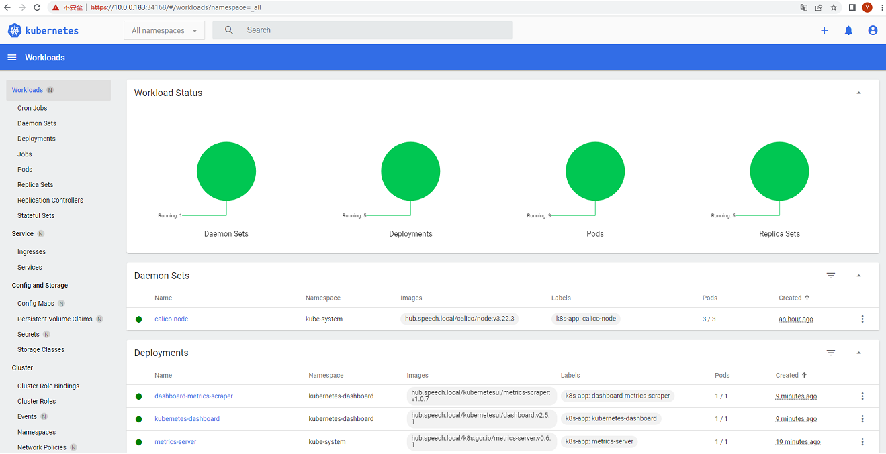
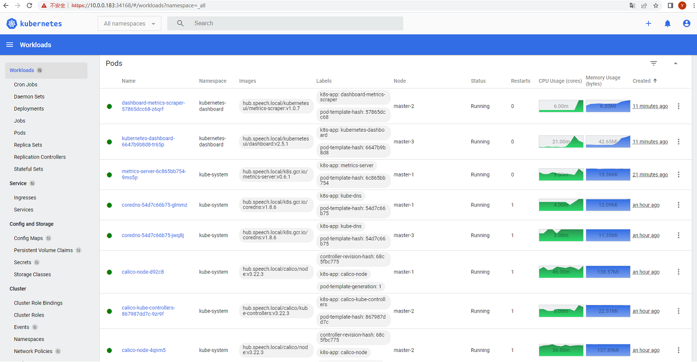

## 一、基于二进制包安装部署生产级别Kubernetes集群
#### 1、环境规划：
|ID  |服务器IP    |主机名           |系统版本            |
|:-: |:-:         |:-:              |:-:                 |
|1   |10.0.0.181  |master-1,etcd-1  |Ubuntu 18.04.6 LTS  |
|2   |10.0.0.182  |master-2,etcd-2  |Ubuntu 18.04.6 LTS  |
|3   |10.0.0.183  |master-3,etcd-3  |Ubuntu 18.04.6 LTS  |
|4   |10.0.0.184  |node-1           |Ubuntu 18.04.6 LTS  |
|5   |10.0.0.185  |node-2           |Ubuntu 18.04.6 LTS  | 
|6   |10.0.0.186  |node-3           |Ubuntu 18.04.6 LTS  |

#### 2、软件包及相关信息：
```shell
k8s-v1.23.9/pkgs/k8s-etcd-3.4.18+bionic_amd64.deb                 # 持久状态存储etcd
k8s-v1.23.9/pkgs/k8s-kubernetes-master-1.23.9+bionic_amd64.deb    # master核心组件（kube-apiserver、kube-controller-manager、kube-scheduler）
k8s-v1.23.9/pkgs/k8s-kubernetes-node-1.23.9+bionic_amd64.deb      # node核心组件（kubelet、kube-proxy）
k8s-v1.23.9/pkgs/k8s-slb-1.16.1+bionic_amd64.deb                  # nginx四层代理，部署在node之上，作为kubelet、kube-proxy的代理访问kube-apiserver
k8s-v1.23.9/calico-v3.22.3                                        # 网络插件calico
k8s-v1.23.9/coredns-v1.8.6                                        # 服务发现coredns
k8s-v1.23.9/dashboard-v2.5.1                                      # 集群可视化dashboard
k8s-v1.23.9/docker-ce-v20.10.12                                   # 容器服务docker
k8s-v1.23.9/metrics-server-v0.6.1                                 # 核心指标监控metrics-server


注意：
k8s-etcd、k8s-kubernetes-master、k8s-kubernetes-node包中二进制程序由官方下载，此处仅做了二次封装，k8s-slb由nginx-1.16.1.tar.gz源码编译，未更改过任何源代码：
https://dl.k8s.io/v1.23.9/kubernetes-server-linux-amd64.tar.gz
https://dl.k8s.io/v1.23.9/kubernetes-client-linux-amd64.tar.gz
https://dl.k8s.io/v1.23.9/kubernetes-node-linux-amd64.tar.gz
https://nginx.org/download/nginx-1.16.1.tar.gz
https://github.com/etcd-io/etcd/releases/download/v3.4.18/etcd-v3.4.18-linux-amd64.tar.gz
```

#### 3、软件包下载地址：
链接: https://pan.baidu.com/s/1i1KOWIPpgS2qfGloXkXaBw </p>
提取码: 64uk 


#### 4、基础环境配置：
- 配置时间同步
- 配置master-1到master-2、master-3免密登录
- 关闭unattended-upgrades.service自动更新服务
- 提前安装ipvsadm、ipset
- 提前安装部署Harbor（当前Harbor域名解析为：hub.speech.local）
- 添加各节点DNS解析或调整本地hosts文件（各个节点都需要）：
```shell
root@master-1:~# vi /etc/hosts
10.0.0.181      master-1 etcd-1
10.0.0.182      master-2 etcd-2
10.0.0.183      master-3 etcd-3
10.0.0.184      node-1
10.0.0.185      node-2
10.0.0.186      node-3
```
- 安装配置Docker（各个节点都需要）：
```shell
root@master-1:~# tar zxf k8s-v1.23.9.tar.gz
root@master-1:~# cd k8s-v1.23.9/docker-ce-v20.10.12/
root@master-1:~/k8s-v1.23.9/docker-ce-v20.10.12# dpkg -i *.deb
root@master-1:~/k8s-v1.23.9/docker-ce-v20.10.12# vi /etc/docker/daemon.json
{
    "exec-opts": ["native.cgroupdriver=systemd"],
    "insecure-registries": ["hub.speech.local"]
}
root@master-1:~/k8s-v1.23.9/docker-ce-v20.10.12# systemctl restart docker
```


## 二、部署etcd集群
#### 1、分别在etcd-1、etcd-2、etcd-3节点安装k8s-etcd-3.4.18+bionic_amd64.deb组件：
```shell
root@master-1:~# cd k8s-v1.23.9/pkgs/
root@master-1:~/k8s-v1.23.9/pkgs# dpkg -i k8s-etcd-3.4.18+bionic_amd64.deb 
Selecting previously unselected package k8s-etcd.
(Reading database ... 66889 files and directories currently installed.)
Preparing to unpack k8s-etcd-3.4.18+bionic_amd64.deb ...
Unpacking k8s-etcd (3.4.18+bionic) ...
Setting up k8s-etcd (3.4.18+bionic) ...
```
```shell
root@master-1:~/k8s-v1.23.9/pkgs# scp k8s-etcd-3.4.18+bionic_amd64.deb root@10.0.0.182:/root
root@master-1:~/k8s-v1.23.9/pkgs# scp k8s-etcd-3.4.18+bionic_amd64.deb root@10.0.0.183:/root
root@master-1:~/k8s-v1.23.9/pkgs# ssh root@10.0.0.182 'cd /root && dpkg -i k8s-etcd-3.4.18+bionic_amd64.deb'
root@master-1:~/k8s-v1.23.9/pkgs# ssh root@10.0.0.183 'cd /root && dpkg -i k8s-etcd-3.4.18+bionic_amd64.deb'
```

#### 2、在etcd-1节点初始化etcd证书（注意双下滑线开头结尾项需要调整）：
```shell
root@master-1:~# cd /k8s/etcd/ssl/cfssl-tools
root@master-1:/k8s/etcd/ssl/cfssl-tools# vi etcd-csr.json
{
    "CN": "etcd",
    "hosts": [
        "10.0.0.181",
        "10.0.0.182",
        "10.0.0.183",
        "127.0.0.1",
        "localhost"
    ],
    "key": {
        "algo": "rsa",
        "size": 2048
    },
    "names": [
        {
            "C": "CN",
            "ST": "BeiJing",
            "L": "BeiJing",
            "O": "etcd",
            "OU": "System"
        }
    ]
}
root@master-1:/k8s/etcd/ssl/cfssl-tools# vi peer-csr.json
{
    "CN": "peer",
    "hosts": [
        "10.0.0.181",
        "10.0.0.182",
        "10.0.0.183",
        "127.0.0.1",
        "localhost"
    ],
    "key": {
        "algo": "rsa",
        "size": 2048
    },
    "names": [
        {
            "C": "CN",
            "ST": "BeiJing",
            "L": "BeiJing",
            "O": "etcd",
            "OU": "System"
        }
    ]
}
root@master-1:/k8s/etcd/ssl/cfssl-tools# ./init-certs.sh 
Init Etcd Certs OK.
root@master-1:/k8s/etcd/ssl/cfssl-tools# ls -lh ../
total 40K
-rw-r--r-- 1 root root 1.1K Jul 20 14:11 ca.csr
-rw------- 1 root root 1.7K Jul 20 14:11 ca-key.pem
-rw-r--r-- 1 root root 1.3K Jul 20 14:11 ca.pem
drwxr-xr-x 2 root root 4.0K Jul 20 14:11 cfssl-tools
-rw-r--r-- 1 root root 1.1K Jul 20 14:11 etcd.csr
-rw------- 1 root root 1.7K Jul 20 14:11 etcd-key.pem
-rw-r--r-- 1 root root 1.4K Jul 20 14:11 etcd.pem
-rw-r--r-- 1 root root 1.1K Jul 20 14:11 peer.csr
-rw------- 1 root root 1.7K Jul 20 14:11 peer-key.pem
-rw-r--r-- 1 root root 1.5K Jul 20 14:11 peer.pem
```

#### 3、分发etcd证书到etcd-2、etcd-3节点：
```shell
root@master-1:~# cd /k8s/etcd
root@master-1:/k8s/etcd# scp -r ssl root@10.0.0.182:/k8s/etcd
root@master-1:/k8s/etcd# scp -r ssl root@10.0.0.183:/k8s/etcd
```

#### 4、分别调整etcd-1、etcd-2、etcd-3配置文件：
```shell
root@master-1:~# cd /k8s/etcd/cfg
root@master-1:/k8s/etcd/cfg# ln -svf etcd.cluster etcd    # 注意etcd默认为单实例配置，这里调整为集群配置
'etcd' -> 'etcd.cluster'
root@master-1:/k8s/etcd/cfg# vi etcd                      # 注意所有双下滑杠开头结尾的配置项都需要调整，ETCD_ARGS和ETCD_DATA_DIR变量值建议调整和节点一致
#[Member]
ETCD_ARGS="--name=etcd-1"
ETCD_DATA_DIR="/k8s/etcd/etcd-1.data"
ETCD_LISTEN_CLIENT_URLS="https://10.0.0.181:2379,https://127.0.0.1:2379"
ETCD_ADVERTISE_CLIENT_URLS="https://10.0.0.181:2379"


#[Clustering]
ETCD_LISTEN_PEER_URLS="https://10.0.0.181:2380"
ETCD_INITIAL_ADVERTISE_PEER_URLS="https://10.0.0.181:2380"
ETCD_INITIAL_CLUSTER="etcd-1=https://10.0.0.181:2380,etcd-2=https://10.0.0.182:2380,etcd-3=https://10.0.0.183:2380"
ETCD_INITIAL_CLUSTER_STATE="new"
ETCD_INITIAL_CLUSTER_TOKEN="etcd-cluster"


#[Security]
ETCD_AUTO_TLS="true"
ETCD_CLIENT_CERT_AUTH="true"
ETCD_TRUSTED_CA_FILE="/k8s/etcd/ssl/ca.pem"
ETCD_CERT_FILE="/k8s/etcd/ssl/etcd.pem"
ETCD_KEY_FILE="/k8s/etcd/ssl/etcd-key.pem"
ETCD_PEER_AUTO_TLS="true"
ETCD_PEER_CLIENT_CERT_AUTH="true"
ETCD_PEER_TRUSTED_CA_FILE="/k8s/etcd/ssl/ca.pem"
ETCD_PEER_CERT_FILE="/k8s/etcd/ssl/peer.pem"
ETCD_PEER_KEY_FILE="/k8s/etcd/ssl/peer-key.pem"
```
```shell
root@master-2:~# cd /k8s/etcd/cfg
root@master-2:/k8s/etcd/cfg# ln -svf etcd.cluster etcd
'etcd' -> 'etcd.cluster'
root@master-2:/k8s/etcd/cfg# vi etcd
#[Member]
ETCD_ARGS="--name=etcd-2"
ETCD_DATA_DIR="/k8s/etcd/etcd-2.data"
ETCD_LISTEN_CLIENT_URLS="https://10.0.0.182:2379,https://127.0.0.1:2379"
ETCD_ADVERTISE_CLIENT_URLS="https://10.0.0.182:2379"


#[Clustering]
ETCD_LISTEN_PEER_URLS="https://10.0.0.182:2380"
ETCD_INITIAL_ADVERTISE_PEER_URLS="https://10.0.0.182:2380"
ETCD_INITIAL_CLUSTER="etcd-1=https://10.0.0.181:2380,etcd-2=https://10.0.0.182:2380,etcd-3=https://10.0.0.183:2380"
ETCD_INITIAL_CLUSTER_STATE="new"
ETCD_INITIAL_CLUSTER_TOKEN="etcd-cluster"


#[Security]
ETCD_AUTO_TLS="true"
ETCD_CLIENT_CERT_AUTH="true"
ETCD_TRUSTED_CA_FILE="/k8s/etcd/ssl/ca.pem"
ETCD_CERT_FILE="/k8s/etcd/ssl/etcd.pem"
ETCD_KEY_FILE="/k8s/etcd/ssl/etcd-key.pem"
ETCD_PEER_AUTO_TLS="true"
ETCD_PEER_CLIENT_CERT_AUTH="true"
ETCD_PEER_TRUSTED_CA_FILE="/k8s/etcd/ssl/ca.pem"
ETCD_PEER_CERT_FILE="/k8s/etcd/ssl/peer.pem"
ETCD_PEER_KEY_FILE="/k8s/etcd/ssl/peer-key.pem"
```
```shell
root@master-3:~# cd /k8s/etcd/cfg
root@master-3:/k8s/etcd/cfg# ln -svf etcd.cluster etcd
'etcd' -> 'etcd.cluster'
root@master-3:/k8s/etcd/cfg# vi etcd
#[Member]
ETCD_ARGS="--name=etcd-3"
ETCD_DATA_DIR="/k8s/etcd/etcd-3.data"
ETCD_LISTEN_CLIENT_URLS="https://10.0.0.183:2379,https://127.0.0.1:2379"
ETCD_ADVERTISE_CLIENT_URLS="https://10.0.0.183:2379"


#[Clustering]
ETCD_LISTEN_PEER_URLS="https://10.0.0.183:2380"
ETCD_INITIAL_ADVERTISE_PEER_URLS="https://10.0.0.183:2380"
ETCD_INITIAL_CLUSTER="etcd-1=https://10.0.0.181:2380,etcd-2=https://10.0.0.182:2380,etcd-3=https://10.0.0.183:2380"
ETCD_INITIAL_CLUSTER_STATE="new"
ETCD_INITIAL_CLUSTER_TOKEN="etcd-cluster"


#[Security]
ETCD_AUTO_TLS="true"
ETCD_CLIENT_CERT_AUTH="true"
ETCD_TRUSTED_CA_FILE="/k8s/etcd/ssl/ca.pem"
ETCD_CERT_FILE="/k8s/etcd/ssl/etcd.pem"
ETCD_KEY_FILE="/k8s/etcd/ssl/etcd-key.pem"
ETCD_PEER_AUTO_TLS="true"
ETCD_PEER_CLIENT_CERT_AUTH="true"
ETCD_PEER_TRUSTED_CA_FILE="/k8s/etcd/ssl/ca.pem"
ETCD_PEER_CERT_FILE="/k8s/etcd/ssl/peer.pem"
ETCD_PEER_KEY_FILE="/k8s/etcd/ssl/peer-key.pem"
```

#### 5、分别在etcd-1、etcd-2、etcd-3节点启动etcd：
```shell
root@master-1:~# systemctl start etcd && systemctl enable etcd
root@master-1:~# ssh root@10.0.0.182 'systemctl start etcd && systemctl enable etcd'
root@master-1:~# ssh root@10.0.0.183 'systemctl start etcd && systemctl enable etcd'
```
```shell
root@master-1:~# ps -ef | grep -v grep | grep etcd
root      6371     1  2 14:50 ?        00:00:12 /k8s/etcd/bin/etcd --name=etcd-1
root@master-1:~# ssh root@10.0.0.182 'ps -ef | grep -v grep | grep etcd'
root      6115     1  2 14:50 ?        00:00:11 /k8s/etcd/bin/etcd --name=etcd-2
root@master-1:~# ssh root@10.0.0.183 'ps -ef | grep -v grep | grep etcd'
root      5824     1  2 14:50 ?        00:00:11 /k8s/etcd/bin/etcd --name=etcd-3
```


## 三、部署Kubernetes集群
#### 1、分别在master-1、master-2、master-3上安装k8s-kubernetes-master-1.23.9+bionic_amd64.deb与k8s-kubernetes-node-1.23.9+bionic_amd64.deb组件：
```shell
root@master-1:~# cd k8s-v1.23.9/pkgs/
root@master-1:~/k8s-v1.23.9/pkgs# dpkg -i k8s-kubernetes-master-1.23.9+bionic_amd64.deb k8s-kubernetes-node-1.23.9+bionic_amd64.deb 
Selecting previously unselected package k8s-kubernetes-master.
(Reading database ... 67136 files and directories currently installed.)
Preparing to unpack k8s-kubernetes-master-1.23.9+bionic_amd64.deb ...
Unpacking k8s-kubernetes-master (1.23.9+bionic) ...
Selecting previously unselected package k8s-kubernetes-node.
Preparing to unpack k8s-kubernetes-node-1.23.9+bionic_amd64.deb ...
Unpacking k8s-kubernetes-node (1.23.9+bionic) ...
Setting up k8s-kubernetes-master (1.23.9+bionic) ...
Setting up k8s-kubernetes-node (1.23.9+bionic) ...
```
```shell
root@master-1:~/k8s-v1.23.9/pkgs# scp k8s-kubernetes-master-1.23.9+bionic_amd64.deb k8s-kubernetes-node-1.23.9+bionic_amd64.deb root@10.0.0.182:/root
root@master-1:~/k8s-v1.23.9/pkgs# scp k8s-kubernetes-master-1.23.9+bionic_amd64.deb k8s-kubernetes-node-1.23.9+bionic_amd64.deb root@10.0.0.183:/root
root@master-1:~/k8s-v1.23.9/pkgs# ssh root@10.0.0.182 'cd /root && dpkg -i k8s-kubernetes-master-1.23.9+bionic_amd64.deb k8s-kubernetes-node-1.23.9+bionic_amd64.deb'
root@master-1:~/k8s-v1.23.9/pkgs# ssh root@10.0.0.183 'cd /root && dpkg -i k8s-kubernetes-master-1.23.9+bionic_amd64.deb k8s-kubernetes-node-1.23.9+bionic_amd64.deb'
```

#### 2、在master-1节点初始化kubernetes集群证书：
```shell
root@master-1:~# cd /k8s/kubernetes/ssl/cfssl-tools/
root@master-1:/k8s/kubernetes/ssl/cfssl-tools# vi kube-apiserver-csr.json  # 注意双下滑杠开头结尾的配置项需要调整
{
    "CN": "kubernetes",
    "hosts": [
        "10.0.0.181",
        "10.0.0.182",
        "10.0.0.183",
        "10.254.0.1",
        "127.0.0.1",
        "localhost",
        "kubernetes",
        "kubernetes.default",
        "kubernetes.default.svc",
        "kubernetes.default.svc.cluster",
        "kubernetes.default.svc.cluster.local"
    ],
    "key": {
        "algo": "rsa",
        "size": 2048
    },
    "names": [
        {
            "C": "CN",
            "ST": "BeiJing",
            "L": "BeiJing",
            "O": "k8s",
            "OU": "System"
        }
    ]
}
root@master-1:/k8s/kubernetes/ssl/cfssl-tools# ./init-certs.sh 
Init Kubernetes Certs OK.
Init Front Proxy Certs OK.
root@master-1:/k8s/kubernetes/ssl/cfssl-tools# ls -lh ../
total 108K
-rw-r--r-- 1 root root 1009 Jul 20 15:18 admin.csr
-rw------- 1 root root 1.7K Jul 20 15:18 admin-key.pem
-rw-r--r-- 1 root root 1.4K Jul 20 15:18 admin.pem
-rw-r--r-- 1 root root 1.1K Jul 20 15:18 ca.csr
-rw------- 1 root root 1.7K Jul 20 15:18 ca-key.pem
-rw-r--r-- 1 root root 1.3K Jul 20 15:18 ca.pem
drwxr-xr-x 2 root root 4.0K Jul 20 15:17 cfssl-tools
-rw-r--r-- 1 root root  944 Jul 20 15:18 front-proxy-ca.csr
-rw------- 1 root root 1.7K Jul 20 15:18 front-proxy-ca-key.pem
-rw-r--r-- 1 root root 1.1K Jul 20 15:18 front-proxy-ca.pem
-rw-r--r-- 1 root root  903 Jul 20 15:18 front-proxy-client.csr
-rw------- 1 root root 1.7K Jul 20 15:18 front-proxy-client-key.pem
-rw-r--r-- 1 root root 1.2K Jul 20 15:18 front-proxy-client.pem
-rw-r--r-- 1 root root 1.3K Jul 20 15:18 kube-apiserver.csr
-rw------- 1 root root 1.7K Jul 20 15:18 kube-apiserver-key.pem
-rw-r--r-- 1 root root 1.6K Jul 20 15:18 kube-apiserver.pem
-rw-r--r-- 1 root root 1.1K Jul 20 15:18 kube-controller-manager.csr
-rw------- 1 root root 1.7K Jul 20 15:18 kube-controller-manager-key.pem
-rw-r--r-- 1 root root 1.4K Jul 20 15:18 kube-controller-manager.pem
-rw-r--r-- 1 root root 1009 Jul 20 15:18 kube-proxy.csr
-rw------- 1 root root 1.7K Jul 20 15:18 kube-proxy-key.pem
-rw-r--r-- 1 root root 1.4K Jul 20 15:18 kube-proxy.pem
-rw-r--r-- 1 root root 1017 Jul 20 15:18 kube-scheduler.csr
-rw------- 1 root root 1.7K Jul 20 15:18 kube-scheduler-key.pem
-rw-r--r-- 1 root root 1.4K Jul 20 15:18 kube-scheduler.pem
-rw------- 1 root root 1.7K Jul 20 15:18 sa.key
-rw-r--r-- 1 root root  451 Jul 20 15:18 sa.pub
```

#### 3、分发kubernetes集群证书到master-2、master-3节点：
```shell
root@master-1:~# cd /k8s/kubernetes
root@master-1:/k8s/kubernetes# scp -r ssl root@10.0.0.182:/k8s/kubernetes
root@master-1:/k8s/kubernetes# scp -r ssl root@10.0.0.183:/k8s/kubernetes
```

#### 4、初始化token.svc、kubeconfig配置文件：
```shell
root@master-1:~# cd /k8s/kubernetes/cfg/init-kubeconfig
root@master-1:/k8s/kubernetes/cfg/init-kubeconfig# ./init-kubeconfig.sh 
Cluster "kubernetes" set.
User "kube-scheduler" set.
Context "kube-scheduler@kubernetes" created.
Switched to context "kube-scheduler@kubernetes".
Cluster "kubernetes" set.
User "kube-controller-manager" set.
Context "kube-controller-manager@kubernetes" created.
Switched to context "kube-controller-manager@kubernetes".
Cluster "kubernetes" set.
User "admin" set.
Context "admin@kubernetes" created.
Switched to context "admin@kubernetes".
Cluster "kubernetes" set.
User "kube-proxy" set.
Context "kube-proxy@kubernetes" created.
Switched to context "kube-proxy@kubernetes".
Cluster "kubernetes" set.
User "kubelet-bootstrap" set.
Context "kubelet-bootstrap@kubernetes" created.
Switched to context "kubelet-bootstrap@kubernetes".
Token: 6b53b52930ed480bb02048d7c547f0ea,kubelet-bootstrap,10001,system:kubelet-bootstrap
root@master-1:/k8s/kubernetes/cfg/init-kubeconfig# ls -lh ../
total 64K
-rw------- 1 root root 6.1K Jul 20 15:31 admin.kubeconfig
-rw------- 1 root root 2.1K Jul 20 15:31 bootstrap.kubeconfig
drwxr-xr-x 2 root root 4.0K Jul 20 15:08 init-kubeconfig
-rw-r--r-- 1 root root 1.5K Jul 18 16:54 kube-apiserver
-rw-r--r-- 1 root root 1017 Jul 18 16:54 kube-controller-manager
-rw------- 1 root root 6.2K Jul 20 15:31 kube-controller-manager.kubeconfig
-rw-r--r-- 1 root root  638 Jul 18 16:54 kubelet
-rw-r--r-- 1 root root  206 Jul 18 16:54 kube-proxy
-rw------- 1 root root 6.1K Jul 20 15:31 kube-proxy.kubeconfig
-rw-r--r-- 1 root root  371 Jul 18 16:54 kube-scheduler
-rw------- 1 root root 6.2K Jul 20 15:31 kube-scheduler.kubeconfig
-rw-r--r-- 1 root root   82 Jul 20 15:31 token.csv
```

#### 5、分发token.svc、kubeconfig配置文件到master-2、master-3节点：
```shell
root@master-1:/k8s/kubernetes# scp -r cfg root@10.0.0.182:/k8s/kubernetes
root@master-1:/k8s/kubernetes# scp -r cfg root@10.0.0.183:/k8s/kubernetes
```

#### 6、调整master-1、master-2、master-3各节点kube-apiserver配置文件：
```shell
root@master-1:~# vi /k8s/kubernetes/cfg/kube-apiserver
KUBE_APISERVER_ARGS=" \
    --advertise-address=10.0.0.181 \                                                             # 注意此项
    --allow-privileged=true \
    --authorization-mode=Node,RBAC \
    --enable-admission-plugins=NodeRestriction \
    --anonymous-auth=false \
    --bind-address=0.0.0.0 \
    --secure-port=6443 \
    --enable-bootstrap-token-auth \
    --token-auth-file=/k8s/kubernetes/cfg/token.csv \
    --client-ca-file=/k8s/kubernetes/ssl/ca.pem \
    --tls-cert-file=/k8s/kubernetes/ssl/kube-apiserver.pem \
    --tls-private-key-file=/k8s/kubernetes/ssl/kube-apiserver-key.pem \
    --etcd-servers=https://10.0.0.181:2379,https://10.0.0.182:2379,https://10.0.0.183:2379 \     # 注意此项
    --etcd-cafile=/k8s/etcd/ssl/ca.pem \
    --etcd-certfile=/k8s/etcd/ssl/etcd.pem \
    --etcd-keyfile=/k8s/etcd/ssl/etcd-key.pem \
    --service-cluster-ip-range=10.254.0.0/16 \
    --service-node-port-range=30000-50000 \
    --service-account-issuer=https://kubernetes.default.svc.cluster.local \
    --service-account-key-file=/k8s/kubernetes/ssl/sa.pub \
    --service-account-signing-key-file=/k8s/kubernetes/ssl/sa.key \
    --proxy-client-cert-file=/k8s/kubernetes/ssl/front-proxy-client.pem \
    --proxy-client-key-file=/k8s/kubernetes/ssl/front-proxy-client-key.pem \
    --requestheader-allowed-names=front-proxy-client \
    --requestheader-client-ca-file=/k8s/kubernetes/ssl/front-proxy-ca.pem \
    --requestheader-extra-headers-prefix=X-Remote-Extra- \
    --requestheader-group-headers=X-Remote-Group \
    --requestheader-username-headers=X-Remote-User \
    --logtostderr=true \
    --v=2"
```
```shell
root@master-2:~# vi /k8s/kubernetes/cfg/kube-apiserver
KUBE_APISERVER_ARGS=" \
    --advertise-address=10.0.0.182 \
    --allow-privileged=true \
    --authorization-mode=Node,RBAC \
    --enable-admission-plugins=NodeRestriction \
    --anonymous-auth=false \
    --bind-address=0.0.0.0 \
    --secure-port=6443 \
    --enable-bootstrap-token-auth \
    --token-auth-file=/k8s/kubernetes/cfg/token.csv \
    --client-ca-file=/k8s/kubernetes/ssl/ca.pem \
    --tls-cert-file=/k8s/kubernetes/ssl/kube-apiserver.pem \
    --tls-private-key-file=/k8s/kubernetes/ssl/kube-apiserver-key.pem \
    --etcd-servers=https://10.0.0.181:2379,https://10.0.0.182:2379,https://10.0.0.183:2379 \
    --etcd-cafile=/k8s/etcd/ssl/ca.pem \
    --etcd-certfile=/k8s/etcd/ssl/etcd.pem \
    --etcd-keyfile=/k8s/etcd/ssl/etcd-key.pem \
    --service-cluster-ip-range=10.254.0.0/16 \
    --service-node-port-range=30000-50000 \
    --service-account-issuer=https://kubernetes.default.svc.cluster.local \
    --service-account-key-file=/k8s/kubernetes/ssl/sa.pub \
    --service-account-signing-key-file=/k8s/kubernetes/ssl/sa.key \
    --proxy-client-cert-file=/k8s/kubernetes/ssl/front-proxy-client.pem \
    --proxy-client-key-file=/k8s/kubernetes/ssl/front-proxy-client-key.pem \
    --requestheader-allowed-names=front-proxy-client \
    --requestheader-client-ca-file=/k8s/kubernetes/ssl/front-proxy-ca.pem \
    --requestheader-extra-headers-prefix=X-Remote-Extra- \
    --requestheader-group-headers=X-Remote-Group \
    --requestheader-username-headers=X-Remote-User \
    --logtostderr=true \
    --v=2"
```
```shell
root@master-3:~# vi /k8s/kubernetes/cfg/kube-apiserver
KUBE_APISERVER_ARGS=" \
    --advertise-address=10.0.0.183 \
    --allow-privileged=true \
    --authorization-mode=Node,RBAC \
    --enable-admission-plugins=NodeRestriction \
    --anonymous-auth=false \
    --bind-address=0.0.0.0 \
    --secure-port=6443 \
    --enable-bootstrap-token-auth \
    --token-auth-file=/k8s/kubernetes/cfg/token.csv \
    --client-ca-file=/k8s/kubernetes/ssl/ca.pem \
    --tls-cert-file=/k8s/kubernetes/ssl/kube-apiserver.pem \
    --tls-private-key-file=/k8s/kubernetes/ssl/kube-apiserver-key.pem \
    --etcd-servers=https://10.0.0.181:2379,https://10.0.0.182:2379,https://10.0.0.183:2379 \
    --etcd-cafile=/k8s/etcd/ssl/ca.pem \
    --etcd-certfile=/k8s/etcd/ssl/etcd.pem \
    --etcd-keyfile=/k8s/etcd/ssl/etcd-key.pem \
    --service-cluster-ip-range=10.254.0.0/16 \
    --service-node-port-range=30000-50000 \
    --service-account-issuer=https://kubernetes.default.svc.cluster.local \
    --service-account-key-file=/k8s/kubernetes/ssl/sa.pub \
    --service-account-signing-key-file=/k8s/kubernetes/ssl/sa.key \
    --proxy-client-cert-file=/k8s/kubernetes/ssl/front-proxy-client.pem \
    --proxy-client-key-file=/k8s/kubernetes/ssl/front-proxy-client-key.pem \
    --requestheader-allowed-names=front-proxy-client \
    --requestheader-client-ca-file=/k8s/kubernetes/ssl/front-proxy-ca.pem \
    --requestheader-extra-headers-prefix=X-Remote-Extra- \
    --requestheader-group-headers=X-Remote-Group \
    --requestheader-username-headers=X-Remote-User \
    --logtostderr=true \
    --v=2"
```

#### 7、启动kube-apiserver：
```shell
root@master-1:~# systemctl start kube-apiserver && systemctl enable kube-apiserver
root@master-1:~# ssh root@10.0.0.182 'systemctl start kube-apiserver && systemctl enable kube-apiserver'
root@master-1:~# ssh root@10.0.0.183 'systemctl start kube-apiserver && systemctl enable kube-apiserver'
```

#### 8、启动kube-controller-manager、kube-scheduler：
```shell
root@master-1:~# systemctl start kube-controller-manager kube-scheduler && systemctl enable kube-controller-manager kube-scheduler
root@master-1:~# ssh root@10.0.0.182 'systemctl start kube-controller-manager kube-scheduler && systemctl enable kube-controller-manager kube-scheduler'
root@master-1:~# ssh root@10.0.0.183 'systemctl start kube-controller-manager kube-scheduler && systemctl enable kube-controller-manager kube-scheduler'
```

#### 9、添加kubernetes可执行程序路径（master-2、master-3也需要）：
```shell
root@master-1:~# echo 'PATH=$PATH:/k8s/kubernetes/bin' >> /etc/profile
root@master-1:~# . /etc/profile
```

#### 10、生成集群管理员配置（master-2、master-3也需要）：
```shell
root@master-1:~# mkdir -p ~/.kube
root@master-1:~# cp /k8s/kubernetes/cfg/admin.kubeconfig ~/.kube/config
```

#### 11、查看集群各组件状态：
```shell
root@master-1:~# kubectl get cs
Warning: v1 ComponentStatus is deprecated in v1.19+
NAME                 STATUS    MESSAGE             ERROR
controller-manager   Healthy   ok                  
scheduler            Healthy   ok                  
etcd-2               Healthy   {"health":"true"}   
etcd-0               Healthy   {"health":"true"}   
etcd-1               Healthy   {"health":"true"}   
```

#### 12、kubelet-bootstrap账号授权：
```shell
root@master-1:~# kubectl create clusterrolebinding kubelet-bootstrap --clusterrole=system:node-bootstrapper --user=kubelet-bootstrap
clusterrolebinding.rbac.authorization.k8s.io/kubelet-bootstrap created
```


## 四、添加master节点到集群
#### 1、调整kubelet配置文件（master-2、master-3也需要调整）：
```shell
root@master-1:~# vi /k8s/kubernetes/cfg/kubelet
KUBELET_ARGS=" \
    --bootstrap-kubeconfig=/k8s/kubernetes/cfg/bootstrap.kubeconfig \
    --kubeconfig=/k8s/kubernetes/cfg/kubelet.kubeconfig \
    --cgroup-driver=systemd \
    --kubelet-cgroups=/systemd/system.slice \
    --runtime-cgroups=/systemd/system.slice \
    --network-plugin=cni \
    --cluster-dns=10.254.0.2 \
    --cluster-domain=cluster.local \
    --fail-swap-on=false \
    --cert-dir=/k8s/kubernetes/ssl \
    --hairpin-mode=promiscuous-bridge \
    --serialize-image-pulls=false \
    --pod-infra-container-image=hub.speech.local/k8s.gcr.io/pause:3.6 \     # 注意此项，pause镜像要提前推送到本地镜像仓库
    --logtostderr=true \
    --v=2"
```

#### 2、启动kubelet、kube-proxy：
```shell
root@master-1:~# systemctl start kubelet kube-proxy && systemctl enable kubelet kube-proxy
root@master-1:~# ssh root@10.0.0.182 'systemctl start kubelet kube-proxy && systemctl enable kubelet kube-proxy'
root@master-1:~# ssh root@10.0.0.183 'systemctl start kubelet kube-proxy && systemctl enable kubelet kube-proxy'
```

#### 3、允许master节点加入集群：
```shell
root@master-1:~# kubectl get csr
NAME                                                   AGE   SIGNERNAME                                    REQUESTOR           REQUESTEDDURATION   CONDITION
node-csr-PNk547vpMHuA-q0rhNCUdrV4KFUh2n5BVPoHPigRGW4   30s   kubernetes.io/kube-apiserver-client-kubelet   kubelet-bootstrap   <none>              Pending
node-csr-aDTDGOPPvkExkqtwjwTwMCMW_sJIYAoJZPGlupysvmg   93s   kubernetes.io/kube-apiserver-client-kubelet   kubelet-bootstrap   <none>              Pending
node-csr-t5ZhqKD6bjot4WSbvbmyYrD520Ba4CpX2gGO-Me9KFo   26s   kubernetes.io/kube-apiserver-client-kubelet   kubelet-bootstrap   <none>              Pending
root@master-1:~# kubectl certificate approve node-csr-PNk547vpMHuA-q0rhNCUdrV4KFUh2n5BVPoHPigRGW4
certificatesigningrequest.certificates.k8s.io/node-csr-PNk547vpMHuA-q0rhNCUdrV4KFUh2n5BVPoHPigRGW4 approved
root@master-1:~# kubectl certificate approve node-csr-aDTDGOPPvkExkqtwjwTwMCMW_sJIYAoJZPGlupysvmg
certificatesigningrequest.certificates.k8s.io/node-csr-aDTDGOPPvkExkqtwjwTwMCMW_sJIYAoJZPGlupysvmg approved
root@master-1:~# kubectl certificate approve node-csr-t5ZhqKD6bjot4WSbvbmyYrD520Ba4CpX2gGO-Me9KFo
certificatesigningrequest.certificates.k8s.io/node-csr-t5ZhqKD6bjot4WSbvbmyYrD520Ba4CpX2gGO-Me9KFo approved
```

#### 4、查看节点（NotReady是因为未部署网络插件）：
```shell
root@master-1:~# kubectl get node -o wide
NAME       STATUS     ROLES    AGE   VERSION   INTERNAL-IP   EXTERNAL-IP   OS-IMAGE             KERNEL-VERSION       CONTAINER-RUNTIME
master-1   NotReady   <none>   81s   v1.23.9   10.0.0.181    <none>        Ubuntu 18.04.6 LTS   4.15.0-156-generic   docker://20.10.12
master-2   NotReady   <none>   93s   v1.23.9   10.0.0.182    <none>        Ubuntu 18.04.6 LTS   4.15.0-156-generic   docker://20.10.12
master-3   NotReady   <none>   69s   v1.23.9   10.0.0.183    <none>        Ubuntu 18.04.6 LTS   4.15.0-156-generic   docker://20.10.12
```


## 五、部署网络插件Calico
#### 1、调整calico镜像仓库地址：
```shell
root@master-1:~# cd k8s-v1.23.9/calico-v3.22.3
root@master-1:~# cat calico.yaml | grep image -n
235:          image: docker.io/calico/cni:v3.22.3
279:          image: docker.io/calico/pod2daemon-flexvol:v3.22.3
290:          image: docker.io/calico/node:v3.22.3
535:          image: docker.io/calico/kube-controllers:v3.22.3
root@master-1:~/k8s-v1.23.9/calico-v3.22.3# vi calico.yaml                # 将镜像调整为以下（镜像要提前下载并推送到本地镜像仓库）：              
235:          image: hub.speech.local/calico/cni:v3.22.3
279:          image: hub.speech.local/calico/pod2daemon-flexvol:v3.22.3
290:          image: hub.speech.local/calico/node:v3.22.3
535:          image: hub.speech.local/calico/kube-controllers:v3.22.3
```

#### 2、设置etcd集群地址：
```shell
root@master-1:~/k8s-v1.23.9/calico-v3.22.3# ETCD_ENDPOINTS="https://10.0.0.181:2379,https://10.0.0.182:2379,https://10.0.0.183:2379"
root@master-1:~/k8s-v1.23.9/calico-v3.22.3# sed -i "s#.*etcd_endpoints:.*#  etcd_endpoints: \"${ETCD_ENDPOINTS}\"#g" calico.yaml
```

#### 3、设置etcd证书：
```shell
root@master-1:~/k8s-v1.23.9/calico-v3.22.3# ETCD_CA=`cat /k8s/etcd/ssl/ca.pem | base64 | tr -d '\n'`
root@master-1:~/k8s-v1.23.9/calico-v3.22.3# ETCD_CERT=`cat /k8s/etcd/ssl/etcd.pem | base64 | tr -d '\n'`
root@master-1:~/k8s-v1.23.9/calico-v3.22.3# ETCD_KEY=`cat /k8s/etcd/ssl/etcd-key.pem | base64 | tr -d '\n'`
root@master-1:~/k8s-v1.23.9/calico-v3.22.3# sed -i "s#.*etcd-ca:.*#  etcd-ca: ${ETCD_CA}#g" calico.yaml
root@master-1:~/k8s-v1.23.9/calico-v3.22.3# sed -i "s#.*etcd-cert:.*#  etcd-cert: ${ETCD_CERT}#g" calico.yaml
root@master-1:~/k8s-v1.23.9/calico-v3.22.3# sed -i "s#.*etcd-key:.*#  etcd-key: ${ETCD_KEY}#g" calico.yaml
root@master-1:~/k8s-v1.23.9/calico-v3.22.3# sed -i 's#.*etcd_ca:.*#  etcd_ca: "/calico-secrets/etcd-ca"#g' calico.yaml
root@master-1:~/k8s-v1.23.9/calico-v3.22.3# sed -i 's#.*etcd_cert:.*#  etcd_cert: "/calico-secrets/etcd-cert"#g' calico.yaml
root@master-1:~/k8s-v1.23.9/calico-v3.22.3# sed -i 's#.*etcd_key:.*#  etcd_key: "/calico-secrets/etcd-key"#g' calico.yaml
```

#### 4、设置Pod地址池（注意要和kube-proxy配置项--cluster-cidr地址池一致）：
```shell
root@master-1:~/k8s-v1.23.9/calico-v3.22.3# CALICO_IPV4POOL_CIDR="10.244.0.0/16"
root@master-1:~/k8s-v1.23.9/calico-v3.22.3# sed -i "s#192.168.0.0/16#${CALICO_IPV4POOL_CIDR}#g" calico.yaml
```

#### 5、创建calico资源：
```shell
root@master-1:~/k8s-v1.23.9/calico-v3.22.3# kubectl apply -f calico.yaml
secret/calico-etcd-secrets created
configmap/calico-config created
clusterrole.rbac.authorization.k8s.io/calico-kube-controllers created
clusterrolebinding.rbac.authorization.k8s.io/calico-kube-controllers created
clusterrole.rbac.authorization.k8s.io/calico-node created
clusterrolebinding.rbac.authorization.k8s.io/calico-node created
daemonset.apps/calico-node created
serviceaccount/calico-node created
deployment.apps/calico-kube-controllers created
serviceaccount/calico-kube-controllers created
poddisruptionbudget.policy/calico-kube-controllers created
```

#### 6、查看pod：
```shell
root@master-1:~# kubectl get pods -A -o wide
NAMESPACE     NAME                                       READY   STATUS    RESTARTS   AGE    IP           NODE       NOMINATED NODE   READINESS GATES
kube-system   calico-kube-controllers-867987dd7c-9zr9f   1/1     Running   0          2m6s   10.0.0.182   master-2   <none>           <none>
kube-system   calico-node-4qnm5                          1/1     Running   0          2m6s   10.0.0.182   master-2   <none>           <none>
kube-system   calico-node-9vbc8                          1/1     Running   0          2m6s   10.0.0.183   master-3   <none>           <none>
kube-system   calico-node-d92c8                          1/1     Running   0          2m6s   10.0.0.181   master-1   <none>           <none>
```

#### 7、再次查看node：
```shell
root@master-1:~# kubectl get node -o wide
NAME       STATUS   ROLES    AGE   VERSION   INTERNAL-IP   EXTERNAL-IP   OS-IMAGE             KERNEL-VERSION       CONTAINER-RUNTIME
master-1   Ready    <none>   22m   v1.23.9   10.0.0.181    <none>        Ubuntu 18.04.6 LTS   4.15.0-156-generic   docker://20.10.12
master-2   Ready    <none>   22m   v1.23.9   10.0.0.182    <none>        Ubuntu 18.04.6 LTS   4.15.0-156-generic   docker://20.10.12
master-3   Ready    <none>   22m   v1.23.9   10.0.0.183    <none>        Ubuntu 18.04.6 LTS   4.15.0-156-generic   docker://20.10.12
```


## 六、部署CoreDNS
#### 1、调整coredns镜像仓库地址：
```shell
root@master-1:~# cd k8s-v1.23.9/coredns-v1.8.6
root@master-1:~/k8s-v1.23.9/coredns-v1.8.6# cat coredns.yaml | grep image: -n
143:        image: registry.cn-hangzhou.aliyuncs.com/google_containers/coredns:v1.8.6
root@master-1:~/k8s-v1.23.9/coredns-v1.8.6# vi coredns.yaml +143       # 将镜像调整为以下（镜像要提前下载并推送到本地镜像仓库）：
143:        image: hub.speech.local/k8s.gcr.io/coredns:v1.8.6
```

#### 2、调整coredns配置：
```shell
root@master-1:~/k8s-v1.23.9/coredns-v1.8.6# CLUSTER_DNS_DOMAIN="cluster.local"
root@master-1:~/k8s-v1.23.9/coredns-v1.8.6# CLUSTER_DNS_SERVER="10.254.0.2"
root@master-1:~/k8s-v1.23.9/coredns-v1.8.6# CLUSTER_DNS_MEMORY_LIMIT="200Mi"
root@master-1:~/k8s-v1.23.9/coredns-v1.8.6# sed -i -e "s@__DNS__DOMAIN__@${CLUSTER_DNS_DOMAIN}@" \
>        -e "s@__DNS__SERVER__@${CLUSTER_DNS_SERVER}@" \
>        -e "s@__DNS__MEMORY__LIMIT__@${CLUSTER_DNS_MEMORY_LIMIT}@" \
>        coredns.yaml
```

#### 3、创建coredns资源：
```shell
root@master-1:~/k8s-v1.23.9/coredns-v1.8.6# kubectl apply -f coredns.yaml
serviceaccount/coredns created
clusterrole.rbac.authorization.k8s.io/system:coredns created
clusterrolebinding.rbac.authorization.k8s.io/system:coredns created
configmap/coredns created
deployment.apps/coredns created
service/kube-dns created
```

#### 4、再次查看pod资源：
```shell
root@master-1:~/k8s-v1.23.9/coredns-v1.8.6# kubectl get pods -A -o wide
NAMESPACE     NAME                                       READY   STATUS    RESTARTS   AGE   IP             NODE       NOMINATED NODE   READINESS GATES
kube-system   calico-kube-controllers-867987dd7c-9zr9f   1/1     Running   0          21m   10.0.0.182     master-2   <none>           <none>
kube-system   calico-node-4qnm5                          1/1     Running   0          21m   10.0.0.182     master-2   <none>           <none>
kube-system   calico-node-9vbc8                          1/1     Running   0          21m   10.0.0.183     master-3   <none>           <none>
kube-system   calico-node-d92c8                          1/1     Running   0          21m   10.0.0.181     master-1   <none>           <none>
kube-system   coredns-54d7c66b75-glmmz                   1/1     Running   0          22s   10.244.218.0   master-1   <none>           <none>
kube-system   coredns-54d7c66b75-jwq8j                   1/1     Running   0          22s   10.244.65.0    master-3   <none>           <none>
```


## 七、部署Metrics-Server（核心指标监控）
1、部署metrics-server前无法查看集群核心指标数据：
```shell
root@master-1:~# kubectl top node
error: Metrics API not available
root@master-1:~# kubectl top pod -A
error: Metrics API not available
```

2、调整metrics-server镜像仓库地址：
```shell
root@master-1:~# cd k8s-v1.23.9/metrics-server-v0.6.1
root@master-1:~/k8s-v1.23.9/metrics-server-v0.6.1# cat components.yaml | grep image: -n
141:        image: registry.cn-hangzhou.aliyuncs.com/google_containers/metrics-server:v0.6.1
root@master-1:~/k8s-v1.23.9/metrics-server-v0.6.1# vi components.yaml +141      # 将镜像调整为以下（镜像要提前下载并推送到本地镜像仓库）：
141:        image: hub.speech.local/k8s.gcr.io/metrics-server:v0.6.1
```

3、创建metrics-server资源：
```shell
root@master-1:~/k8s-v1.23.9/metrics-server-v0.6.1# kubectl apply -f components.yaml
serviceaccount/metrics-server created
clusterrole.rbac.authorization.k8s.io/system:aggregated-metrics-reader created
clusterrole.rbac.authorization.k8s.io/system:metrics-server created
rolebinding.rbac.authorization.k8s.io/metrics-server-auth-reader created
clusterrolebinding.rbac.authorization.k8s.io/metrics-server:system:auth-delegator created
clusterrolebinding.rbac.authorization.k8s.io/system:metrics-server created
service/metrics-server created
deployment.apps/metrics-server created
apiservice.apiregistration.k8s.io/v1beta1.metrics.k8s.io created
```

4、查看pod：
```shell
root@master-1:~# kubectl get pods -A -o wide
NAMESPACE     NAME                                       READY   STATUS    RESTARTS      AGE   IP             NODE       NOMINATED NODE   READINESS GATES
kube-system   calico-kube-controllers-867987dd7c-9zr9f   1/1     Running   1 (32m ago)   62m   10.0.0.182     master-2   <none>           <none>
kube-system   calico-node-4qnm5                          1/1     Running   1 (32m ago)   62m   10.0.0.182     master-2   <none>           <none>
kube-system   calico-node-9vbc8                          1/1     Running   1 (32m ago)   62m   10.0.0.183     master-3   <none>           <none>
kube-system   calico-node-d92c8                          1/1     Running   1 (32m ago)   62m   10.0.0.181     master-1   <none>           <none>
kube-system   coredns-54d7c66b75-glmmz                   1/1     Running   1 (32m ago)   42m   10.244.218.1   master-1   <none>           <none>
kube-system   coredns-54d7c66b75-jwq8j                   1/1     Running   1 (31m ago)   42m   10.244.65.1    master-3   <none>           <none>
kube-system   metrics-server-6c865bb754-9ms5p            1/1     Running   0             59s   10.244.218.2   master-1   <none>           <none>
```

5、查看核心资源指标：
```shell
root@master-1:~# kubectl top node
NAME       CPU(cores)   CPU%   MEMORY(bytes)   MEMORY%   
master-1   219m         10%    1006Mi          53%       
master-2   246m         12%    794Mi           41%       
master-3   211m         10%    805Mi           42%       
root@master-1:~# kubectl top pod -A
NAMESPACE     NAME                                       CPU(cores)   MEMORY(bytes)   
kube-system   calico-kube-controllers-867987dd7c-9zr9f   4m           22Mi            
kube-system   calico-node-4qnm5                          44m          137Mi           
kube-system   calico-node-9vbc8                          40m          137Mi           
kube-system   calico-node-d92c8                          39m          138Mi           
kube-system   coredns-54d7c66b75-glmmz                   3m           11Mi            
kube-system   coredns-54d7c66b75-jwq8j                   2m           11Mi            
kube-system   metrics-server-6c865bb754-9ms5p            6m           15Mi    
```


## 八、部署Dashboard（按需部署）
#### 1、调整dashboard镜像仓库地址：
```shell
root@master-1:~# cd k8s-v1.23.9/dashboard-v2.5.1/
root@master-1:~/k8s-v1.23.9/dashboard-v2.5.1# cat recommended.yaml | grep image: -n
194:          image: kubernetesui/dashboard:v2.5.1
279:          image: kubernetesui/metrics-scraper:v1.0.7
root@master-1:~/k8s-v1.23.9/dashboard-v2.5.1# vi recommended.yaml     # 将镜像调整为以下（镜像要提前下载并推送到本地镜像仓库）：
194:          image: hub.speech.local/kubernetesui/dashboard:v2.5.1
279:          image: hub.speech.local/kubernetesui/metrics-scraper:v1.0.7
```

#### 2、创建dashboard资源：
```shell
root@master-1:~/k8s-v1.23.9/dashboard-v2.5.1# kubectl apply -f recommended.yaml
namespace/kubernetes-dashboard created
serviceaccount/kubernetes-dashboard created
service/kubernetes-dashboard created
secret/kubernetes-dashboard-certs created
secret/kubernetes-dashboard-csrf created
secret/kubernetes-dashboard-key-holder created
configmap/kubernetes-dashboard-settings created
role.rbac.authorization.k8s.io/kubernetes-dashboard created
clusterrole.rbac.authorization.k8s.io/kubernetes-dashboard created
rolebinding.rbac.authorization.k8s.io/kubernetes-dashboard created
clusterrolebinding.rbac.authorization.k8s.io/kubernetes-dashboard created
deployment.apps/kubernetes-dashboard created
service/dashboard-metrics-scraper created
deployment.apps/dashboard-metrics-scraper created
```

#### 3、创建ServiceAccount账号dashboard-view（该账号只有查看权限）
```shell
root@master-1:~/k8s-v1.23.9/dashboard-v2.5.1# kubectl apply -f dashboard-view.yaml 
serviceaccount/dashboard-view created
clusterrolebinding.rbac.authorization.k8s.io/dashboard-view created
```

#### 4、查看pod：
```shell
root@master-1:~/k8s-v1.23.9/dashboard-v2.5.1# kubectl get pods -A -o wide
NAMESPACE              NAME                                         READY   STATUS    RESTARTS      AGE     IP             NODE       NOMINATED NODE   READINESS GATES
kube-system            calico-kube-controllers-867987dd7c-9zr9f     1/1     Running   1 (47m ago)   77m     10.0.0.182     master-2   <none>           <none>
kube-system            calico-node-4qnm5                            1/1     Running   1 (47m ago)   77m     10.0.0.182     master-2   <none>           <none>
kube-system            calico-node-9vbc8                            1/1     Running   1 (47m ago)   77m     10.0.0.183     master-3   <none>           <none>
kube-system            calico-node-d92c8                            1/1     Running   1 (47m ago)   77m     10.0.0.181     master-1   <none>           <none>
kube-system            coredns-54d7c66b75-glmmz                     1/1     Running   1 (47m ago)   57m     10.244.218.1   master-1   <none>           <none>
kube-system            coredns-54d7c66b75-jwq8j                     1/1     Running   1 (46m ago)   57m     10.244.65.1    master-3   <none>           <none>
kube-system            metrics-server-6c865bb754-9ms5p              1/1     Running   0             15m     10.244.218.2   master-1   <none>           <none>
kubernetes-dashboard   dashboard-metrics-scraper-57865dcc68-z6qrf   1/1     Running   0             6m15s   10.244.57.0    master-2   <none>           <none>
kubernetes-dashboard   kubernetes-dashboard-6647b9b8d8-tr65p        1/1     Running   0             6m15s   10.244.65.2    master-3   <none>           <none>
```

#### 5、获取dashboard-view账号token值：
```shell
root@master-1:~/k8s-v1.23.9/dashboard-v2.5.1# ./get_token.sh 
eyJhbGciOiJSUzI1NiIsImtpZCI6IlpGd2N0bm9aM042MjYwYTg5Smo5NG9O.....
```

#### 6、获取dashboard NodePort（此处端口自动分配为：34168）
```shell
root@master-1:~/k8s-v1.23.9/dashboard-v2.5.1# kubectl get svc -A -o wide
NAMESPACE              NAME                        TYPE        CLUSTER-IP       EXTERNAL-IP   PORT(S)                  AGE     SELECTOR
default                kubernetes                  ClusterIP   10.254.0.1       <none>        443/TCP                  149m    <none>
kube-system            kube-dns                    ClusterIP   10.254.0.2       <none>        53/UDP,53/TCP,9153/TCP   54m     k8s-app=kube-dns
kube-system            metrics-server              ClusterIP   10.254.157.176   <none>        443/TCP                  13m     k8s-app=metrics-server
kubernetes-dashboard   dashboard-metrics-scraper   ClusterIP   10.254.133.164   <none>        8000/TCP                 3m28s   k8s-app=dashboard-metrics-scraper
kubernetes-dashboard   kubernetes-dashboard        NodePort    10.254.48.190    <none>        443:34168/TCP            3m28s   k8s-app=kubernetes-dashboard
```

#### 7、当前集群未添加node，使用master任意ip（ 例如：https://10.0.0.183:34168 ）即可打开dashboard界面：




## 九、给Master添加污点并重启控制平面
#### 1、master作为集群控制平面一般不会运行负载：
```shell
root@master-1:~# kubectl taint node master-1 node-role.kubernetes.io/master:NoSchedule
node/master-1 tainted
root@master-1:~# kubectl taint node master-2 node-role.kubernetes.io/master:NoSchedule
node/master-2 tainted
root@master-1:~# kubectl taint node master-3 node-role.kubernetes.io/master:NoSchedule
node/master-3 tainted
```

#### 2、重启后master节点（包括node节点）会自动调整service为ipvs（取决于deb包中自动加载的内核模块）：
```shell
root@master-1:~# dpkg -c k8s-v1.23.9/pkgs/k8s-kubernetes-node-1.23.9+bionic_amd64.deb | grep k8s.conf
-rw-r--r-- root/root        28 2022-07-18 16:54 ./etc/modules-load.d/k8s.conf
-rw-r--r-- root/root       103 2022-07-18 16:54 ./etc/sysctl.d/k8s.conf
root@master-1:~# ipvsadm -ln
IP Virtual Server version 1.2.1 (size=4096)
Prot LocalAddress:Port Scheduler Flags
  -> RemoteAddress:Port           Forward Weight ActiveConn InActConn
TCP  10.254.0.1:443 lc
  -> 10.0.0.181:6443              Masq    1      1          0         
  -> 10.0.0.182:6443              Masq    1      1          0         
  -> 10.0.0.183:6443              Masq    1      1          0         
TCP  10.254.0.2:53 lc
  -> 10.244.65.1:53               Masq    1      0          0         
  -> 10.244.218.1:53              Masq    1      0          0         
TCP  10.254.0.2:9153 lc
  -> 10.244.65.1:9153             Masq    1      0          0         
  -> 10.244.218.1:9153            Masq    1      0          0         
UDP  10.254.0.2:53 lc
  -> 10.244.65.1:53               Masq    1      0          0         
  -> 10.244.218.1:53              Masq    1      0          0        
```


